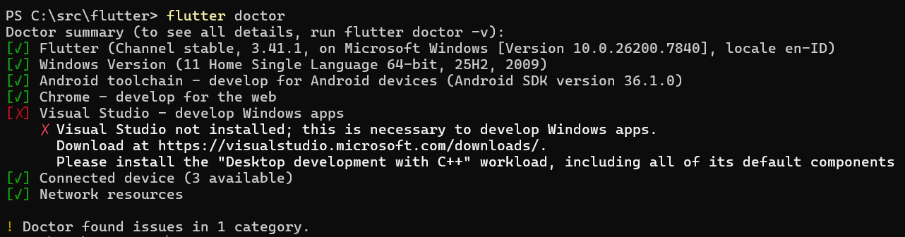

# Laporan Praktikum #01 - Pengantar Pemrograman Mobile

## Identitas Mahasiswa

| Atribut | Nilai                          |
| ------- | -----                          |
| Nama    | Aamira Faheema Ghania  |
| NIM     | 244107060081                  |
| Kelas   | SIB-2D                         |

---

## Tugas Praktikum 1

### Hasil Flutter Doctor

Berikut ini adalah hasil dari perintah `flutter doctor` yang menunjukkan bahwa semua komponen telah terinstal dan terkonfigurasi dengan baik:

> **Catatan:** Semua komponen telah terpasang dengan baik dan tidak ada issue yang ditemukan (`No issues found!`).
