# Laporan Praktikum #10 - Dasar State Management

Nama: Aamira Faheema Ghania  
NIM: 244107060081                  
Kelas: SIB-2D     
Absen: 01                             

## Praktikum 1: Dasar State dengan Model-View
### Langkah 1: Buat Project Baru
Buat sebuah project flutter baru dengan nama master_plan. Lalu buat susunan folder dalam project seperti gambar berikut ini.

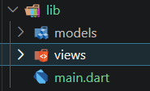

### Langkah 2: Membuat model task.dart
Di folder model, buat file bernama task.dart dan buat class Task. Class ini memiliki atribut description dengan tipe data String dan complete dengan tipe data Boolean, serta ada konstruktor. Kelas ini akan menyimpan data tugas untuk aplikasi.

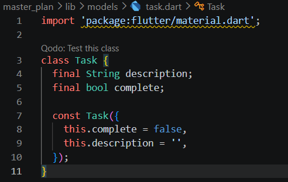

### Langkah 3: Buat file plan.dart
Kita juga perlu sebuah List untuk menyimpan daftar rencana dalam aplikasi to-do ini. Buat file plan.dart di dalam folder models.

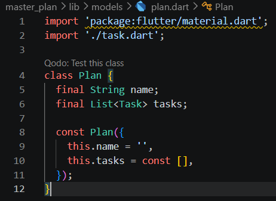

### Langkah 4: Buat file data_layer.dart
Kita dapat membungkus beberapa data layer ke dalam sebuah file yang nanti akan mengekspor kedua model tersebut. Dengan begitu, proses impor akan lebih ringkas seiring berkembangnya aplikasi. Buat file bernama data_layer.dart di folder models. Kodenya hanya berisi export seperti berikut.

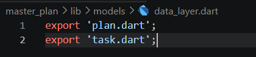

### Langkah 5: Pindah ke file main.dart
Ubah isi kode main.dart sebagai berikut.

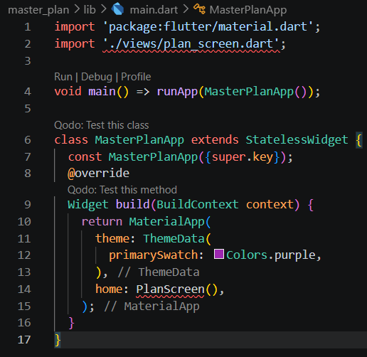

### Langkah 6: buat plan_screen.dart
Pada folder views, buat sebuah file plan_screen.dart dan gunakan templat StatefulWidget untuk membuat class PlanScreen.

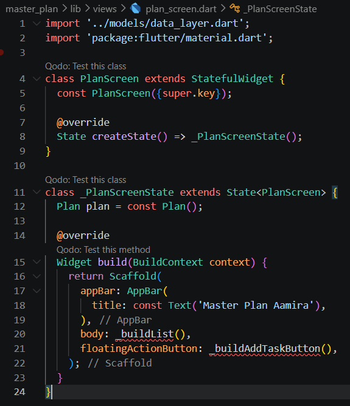

### Langkah 7: buat method _buildAddTaskButton()
Tambah kode berikut di bawah method build di dalam class _PlanScreenState.

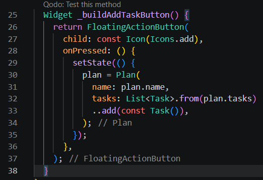

### Langkah 8: buat widget _buildList()
Kita akan buat widget berupa List yang dapat dilakukan scroll, yaitu ListView.builder.

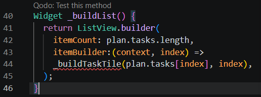

### Langkah 9: buat widget _buildTaskTile
Kita buat dinamis untuk setiap index data, sehingga membuat view menjadi lebih mudah. Tambahkan kode berikut ini.

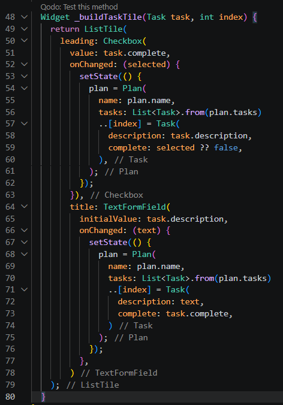

Hasil run:

### Langkah 10: Tambah Scroll Controller
Ketika keyboard tampil, Anda akan kesulitan untuk mengisi yang paling bawah. Untuk mengatasi itu, Anda dapat menggunakan ScrollController untuk menghapus focus dari semua TextField selama event scroll dilakukan. Pada file plan_screen.dart, tambahkan variabel scroll controller di class State tepat setelah variabel plan.

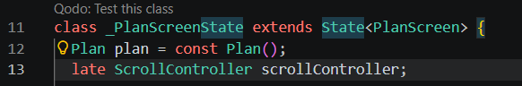

### Langkah 11: Tambah Scroll Listener
Tambahkan method initState() setelah deklarasi variabel scrollController seperti kode berikut.

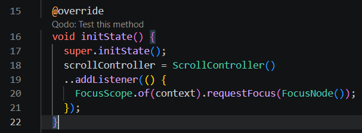

### Langkah 12: Tmabah controller dan keyboard behavior
Tambahkan controller dan keyboard behavior pada ListView di method _buildList seperti kode berikut ini.

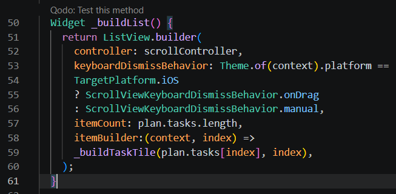

### Langkah 13: Tambah method dispose()
Tambahkan method dispose() berguna ketika widget sudah tidak digunakan lagi.

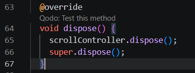

### Langkah 14: Hasil
Lakukan Hot restart.

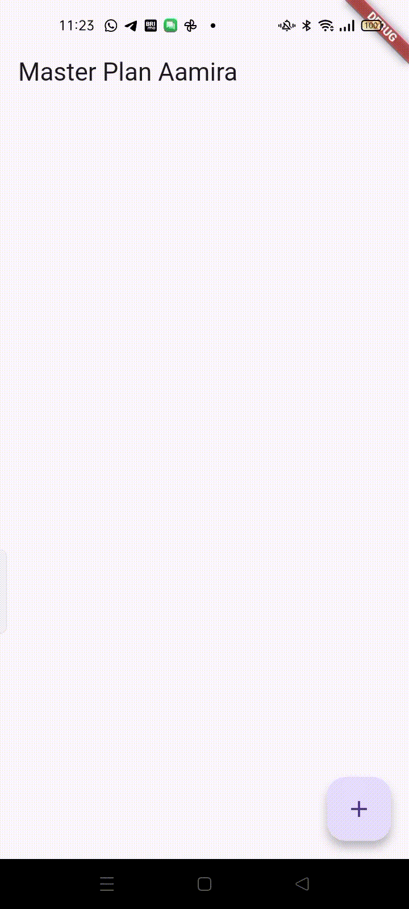

Aplikasi tersebut menggunakan class Task untuk menyimpan data tugas berupa deskripsi dan status selesai, serta class Plan untuk menyimpan kumpulan tugas. Pada halaman utama PlanScreen, pengguna dapat menambahkan tugas baru melalui tombol FloatingActionButton, menuliskan isi tugas menggunakan TextFormField, dan menandai tugas yang sudah selesai dengan Checkbox. Daftar tugas ditampilkan secara dinamis menggunakan ListView.builder, sedangkan setState() digunakan agar tampilan aplikasi langsung diperbarui setiap kali terjadi perubahan data.

## Tugas Praktikum 1: Dasar State dengan Model-View
### No. 2
Jelaskan maksud dari langkah 4 pada praktikum tersebut! Mengapa dilakukan demikian?

Jawab:

File data_layer.dart dilakukan untuk menggabungkan beberapa file model ke dalam satu tempat menggunakan export. Dengan cara ini, file lain cukup melakukan satu kali import saja untuk mengakses semua model seperti Plan dan Task. Hal tersebut membuat penulisan kode menjadi lebih ringkas, rapi, dan mudah dikelola, terutama ketika jumlah model dalam aplikasi semakin banyak dan kompleks.

### No. 3
Mengapa perlu variabel plan di langkah 6 pada praktikum tersebut? Mengapa dibuat konstanta ?

Jawab:

Variabel plan diperlukan untuk menyimpan seluruh data rencana dan daftar tugas yang akan ditampilkan serta diubah pada halaman PlanScreen. Karena aplikasi menggunakan konsep state pada StatefulWidget, data tersebut harus disimpan di dalam state agar dapat diperbarui ketika pengguna menambah atau mengedit tugas. Variabel ini dibuat dengan const Plan() karena class Plan memiliki constructor const, sehingga objek awal dapat dianggap immutable atau tidak berubah secara langsung. Penggunaan const juga membantu meningkatkan efisiensi Flutter karena objek konstan dapat dioptimalkan dan digunakan kembali oleh sistem.

### No. 4
Lakukan capture hasil dari Langkah 9 berupa GIF, kemudian jelaskan apa yang telah Anda buat!

Jawab:

Pada langkah 9, telah dibuat sebuah aplikasi Flutter sederhana berupa aplikasi to-do list / task planner bernama Master Plan. Aplikasi ini menggunakan model Task untuk menyimpan data tugas dan model Plan untuk menyimpan kumpulan daftar tugas. Pengguna dapat menambahkan tugas baru melalui tombol FloatingActionButton berikon +, kemudian menuliskan deskripsi tugas menggunakan TextFormField. Setiap tugas juga memiliki Checkbox yang dapat digunakan untuk menandai apakah tugas sudah selesai atau belum. Seluruh daftar tugas ditampilkan secara dinamis menggunakan ListView.builder, sehingga tampilan akan otomatis bertambah ketika pengguna menambahkan task baru. Selain itu, aplikasi memanfaatkan setState() agar setiap perubahan data langsung memperbarui tampilan antarmuka secara real-time.

### No. 5
Apa kegunaan method pada Langkah 11 dan 13 dalam lifecyle state ?

Jawab:

Method initState() pada langkah 11 digunakan pada awal lifecycle StatefulWidget, yaitu saat widget pertama kali dibuat. Method ini dipakai untuk melakukan inisialisasi awal, seperti membuat ScrollController dan menambahkan listener agar keyboard otomatis kehilangan fokus ketika pengguna melakukan scroll. Dengan demikian, pengalaman penggunaan aplikasi menjadi lebih nyaman.

Sedangkan method dispose() pada langkah 13 digunakan pada akhir lifecycle state, yaitu ketika widget sudah tidak dipakai atau dihapus dari layar. Method ini berfungsi membersihkan resource yang masih digunakan, seperti scrollController, agar tidak terjadi memory leak atau penggunaan memori yang tidak diperlukan.

## Praktikum 2: Mengelola Data Layer dengan InheritedWidget dan InheritedNotifier
### Langkah 1: Buat file plan_provider.dart
Buat folder baru provider di dalam folder lib, lalu buat file baru dengan nama plan_provider.dart.

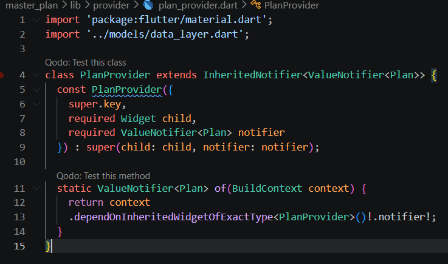

### Langkah 2: Edit main.dart
Gantilah pada bagian atribut home dengan PlanProvider seperti berikut.

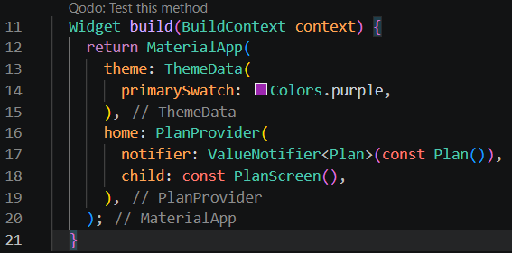

### Langkah 3: Tambah method pada model plan.dart
Tambahkan dua method di dalam model class Plan seperti kode berikut.

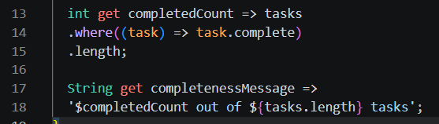

### Langkah 4: Pindah ke PlanScreen
Edit PlanScreen agar menggunakan data dari PlanProvider. Hapus deklarasi variabel plan.

### Langkah 5: Edit method _buildAddTaskButton
Tambahkan BuildContext sebagai parameter dan gunakan PlanProvider sebagai sumber datanya.

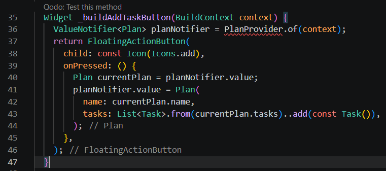

### Langkah 6: Edit method _buildTaskTile
Tambahkan parameter BuildContext, gunakan PlanProvider sebagai sumber data. Ganti TextField menjadi TextFormField untuk membuat inisial data provider menjadi lebih mudah.

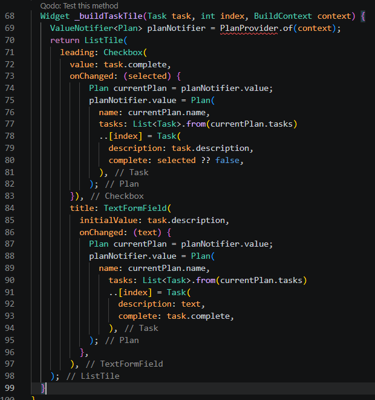

### Langkah 7: Edit _buildList
Sesuaikan parameter pada bagian _buildTaskTile seperti kode berikut.

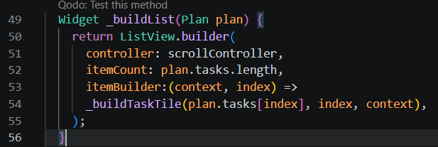

### Langkah 8: Tetap di class PlanScreen

Edit method build sehingga bisa tampil progress pada bagian bawah (footer). Caranya, bungkus (wrap) _buildList dengan widget Expanded dan masukkan ke dalam widget Column. 

### Langkah 9: Tambah widget SafeArea
Terakhir, tambahkan widget SafeArea dengan berisi completenessMessage pada akhir widget Column. 

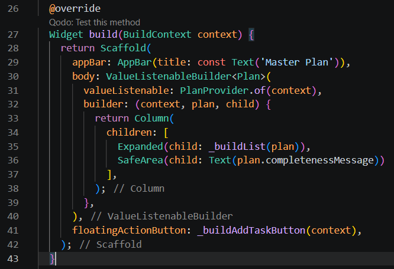

Hasil run:

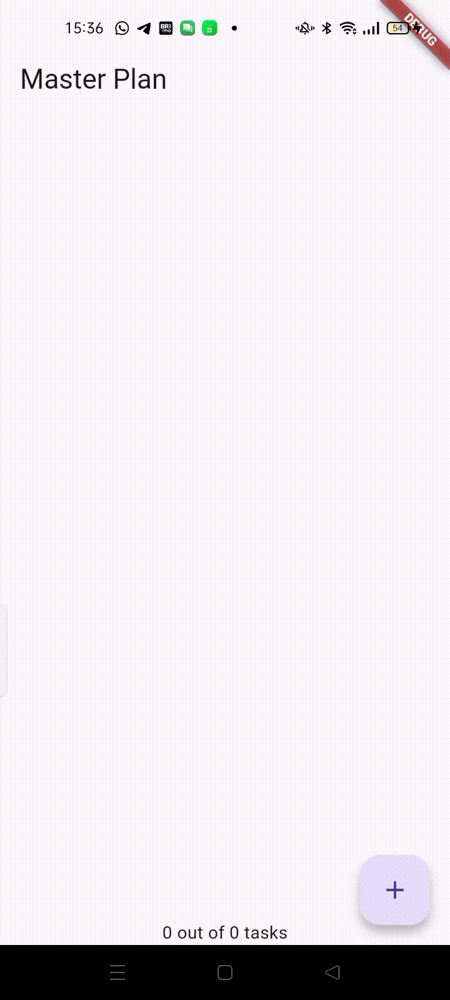

run aplikasi. Tidak akan terlihat perubahan pada UI, namun dengan melakukan langkah-langkah di atas, artinya telah menerapkan cara memisahkan dengan baik antara view dan model. Ini merupakan hal terpenting dalam mengelola state di aplikasi.

## Tugas Praktikum 2: InheritedWidget
### No. 2
Jelaskan mana yang dimaksud InheritedWidget pada langkah 1 tersebut! Mengapa yang digunakan InheritedNotifier?

Jawab:

Pada langkah 1, konsep InheritedWidget terdapat pada class PlanProvider karena PlanProvider mewarisi InheritedNotifier, sedangkan InheritedNotifier sendiri merupakan turunan dari InheritedWidget. InheritedWidget digunakan untuk membagikan data ke seluruh widget turunan tanpa harus mengirim data melalui constructor secara terus-menerus. Pada kode ini digunakan InheritedNotifier karena data Plan dapat berubah. InheritedNotifier dapat mendengarkan perubahan dari ValueNotifier<Plan> dan secara otomatis memperbarui widget yang menggunakan data tersebut. Dengan begitu, pengelolaan state menjadi lebih mudah dan tidak perlu melakukan update widget secara manual seperti jika menggunakan InheritedWidget biasa.

### No. 3
Jelaskan maksud dari method di langkah 3 pada praktikum tersebut! Mengapa dilakukan demikian?

Jawab:

Pada langkah 3, ditambahkan dua method getter pada class Plan untuk membantu menghitung dan menampilkan progres penyelesaian tugas secara otomatis. Method completedCount digunakan untuk menghitung jumlah task yang sudah selesai dengan cara mengambil task yang memiliki nilai complete = true, kemudian menghitung totalnya menggunakan length. Sedangkan completenessMessage digunakan untuk membuat pesan ringkasan progres, misalnya “3 out of 5 tasks”. Penambahan method ini dilakukan agar logika perhitungan progres tersimpan langsung di dalam model Plan, sehingga kode menjadi lebih rapi, mudah digunakan kembali, dan tampilan UI tidak perlu menghitung ulang data secara manual setiap kali ingin menampilkan jumlah tugas yang selesai.

### No. 4
Lakukan capture hasil dari Langkah 9 berupa GIF, kemudian jelaskan apa yang telah Anda buat!

Jawab:

Pada langkah 9, aplikasi telah berhasil menampilkan daftar tugas (task list) menggunakan state management InheritedNotifier dan ValueNotifier. Widget ValueListenableBuilder digunakan agar tampilan otomatis diperbarui ketika data pada Plan berubah, misalnya saat menambah atau menyelesaikan tugas. Di dalam Column, widget Expanded digunakan untuk menampilkan daftar task, sedangkan SafeArea digunakan untuk menampilkan completenessMessage di bagian bawah layar dengan aman agar tidak tertutup oleh notch, status bar, atau navigasi perangkat. Pesan tersebut menampilkan progres tugas. 

## Praktikum 3: Membuat State di Multiple Screens
### Langkah 1: Edit PlanProvider
Edit class PlanProvider sehingga dapat menangani List Plan.

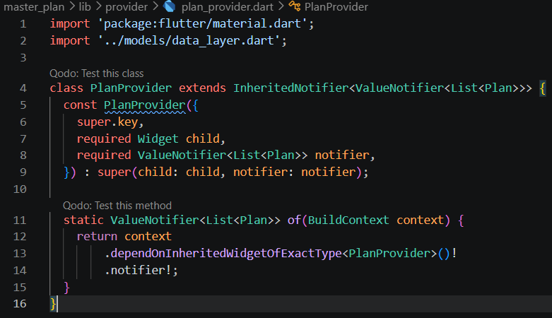

### Langkah 2: Edit main.dart
Langkah sebelumnya dapat menyebabkan error pada main.dart dan plan_screen.dart. Pada method build, gantilah menjadi kode seperti ini.

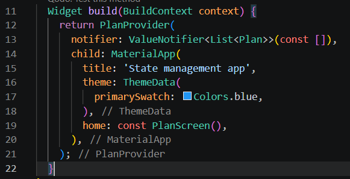

### Langkah 3: Edit plan_screen.dart
Tambahkan variabel plan dan atribut pada constructor-nya.

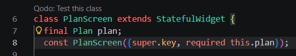

### Langkah 4: Error
Itu akan terjadi error setiap kali memanggil PlanProvider.of(context). Itu terjadi karena screen saat ini hanya menerima tugas-tugas untuk satu kelompok Plan, tapi sekarang PlanProvider menjadi list dari objek plan tersebut.

### Langkah 5: Tambah getter Plan
Tambahkan getter pada _PlanScreenState.

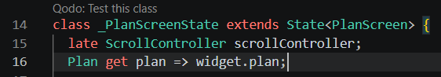

### Langkah 6: Method initState()
Pada bagian method initState() tidak ada perubahan kode.

### Langkah 7: Widget build
Pastikan telah merubah ke List dan mengubah nilai pada currentPlan seperti kode berikut ini.

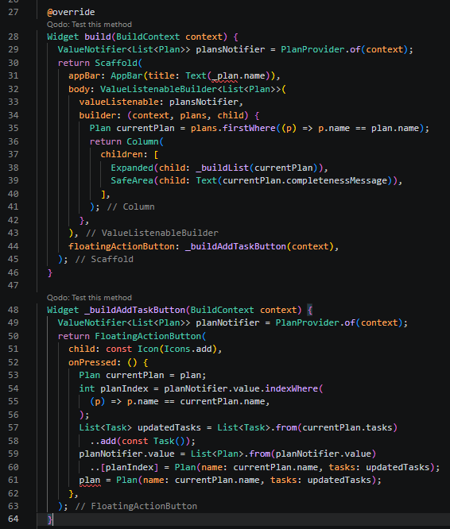

### Langkah 8: Edit _buildTaskTile
Pastikan ubah ke List dan variabel planNotifier.

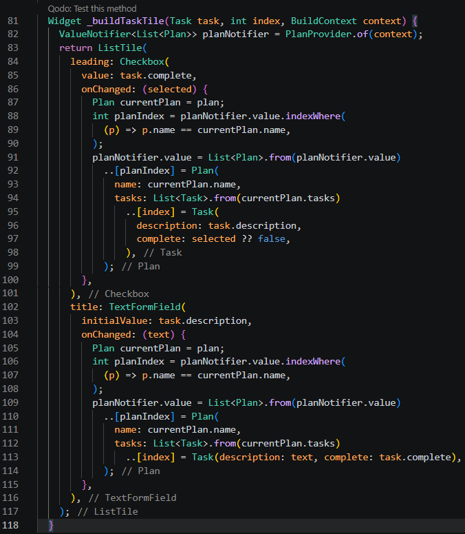

### Langkah 9: Buat screen baru
Pada folder view, buat file baru dengan nama plan_creator_screen.dart dan deklarasikan dengan StatefulWidget bernama PlanCreatorScreen. Gantilah di main.dart pada atribut home menjadi seperti berikut.

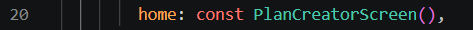

### Langkah 10: Pindah ke class _PlanCreatorScreenState
Tambahkan variabel TextEditingController sehingga bisa membuat TextField sederhana untuk menambah Plan baru. Tambahkan juga dispose ketika widget unmounted.

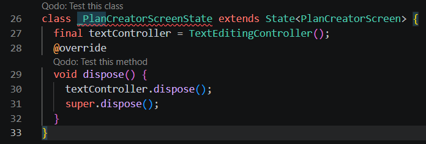

### Langkah 11: Pindah ke method build
Letakkan method Widget build berikut di atas void dispose. 

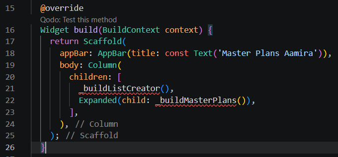

### Langkah 12: Buat widget _buildListCreator
Buat widget berikut setelah widget build.

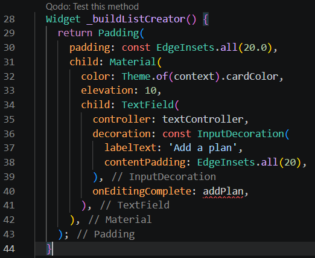

### Langkah 13: Buat void addPlan()
Tambahkan method berikut untuk menerima inputan dari user berupa text plan.

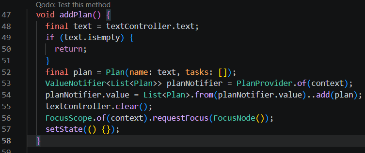

### Langkah 14: Buat widget _buildMasterPlans()
Tambahkan widget _buildMasterPlans()

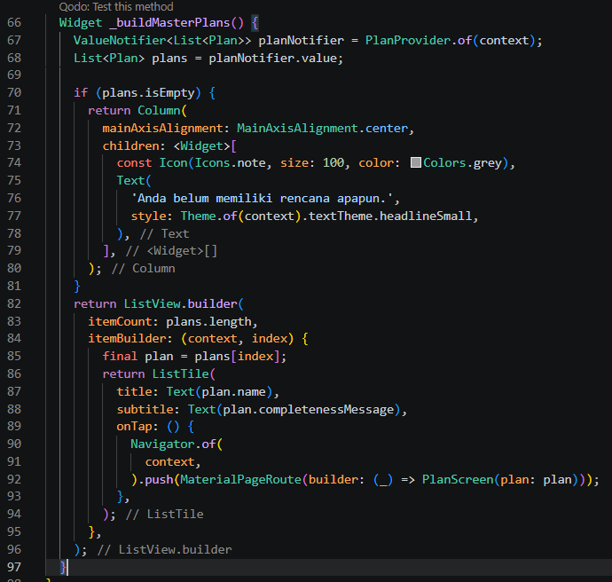

Hasil run:

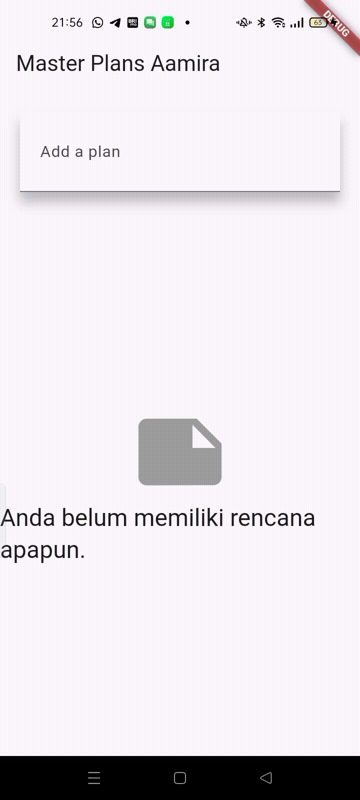

## Tugas Praktikum 3: State di Multiple Screens
### No. 2
Berdasarkan Praktikum 3 yang telah Anda lakukan, jelaskan maksud dari gambar diagram berikut ini!

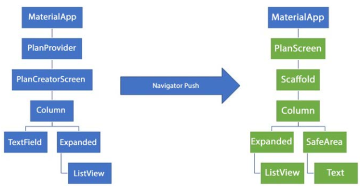

Jawab:

Diagram tersebut menunjukkan alur widget dan perpindahan screen pada aplikasi Master Plan. PlanProvider digunakan untuk menyimpan state global yang dapat diakses oleh PlanCreatorScreen dan PlanScreen. Pada PlanCreatorScreen, pengguna dapat menambah dan melihat daftar plan, lalu menggunakan Navigator.push untuk membuka PlanScreen yang menampilkan daftar task dan progres penyelesaiannya.

### No. 3
Lakukan capture hasil dari Langkah 14 berupa GIF, kemudian jelaskan apa yang telah Anda buat!

Jawab:

Hasil praktikum ini adalah aplikasi Master Plan yang dapat mengelola banyak plan dalam beberapa screen. Pengguna dapat menambahkan plan baru, melihat daftar plan beserta progres task, lalu membuka setiap plan untuk menambah, mengubah, dan menandai task selesai. State aplikasi dikelola menggunakan InheritedNotifier dan ValueNotifier<List<Plan>> sehingga perubahan data otomatis diperbarui pada seluruh screen.