# Laporan Praktikum #11 - Pemrograman Asynchronous

Nama: Aamira Faheema Ghania  
NIM: 244107060081                  
Kelas: SIB-2D     
Absen: 01                             

## Praktikum 1: Mengunduh Data dari Web Service (API)
### Langkah 1: Buat Project Baru
Buat sebuah project flutter baru dengan nama books.

Kemudian menambahkan dependensi http.

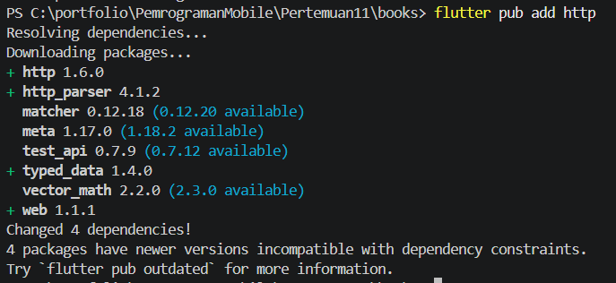

### Langkah 2: Cek file pubspec.yaml
Tanda berhasil install plugin: plugin http telah ada di file pubspec.

### Langkah 3: Buka file main.dart
#### Soal 1: Tambahkan nama panggilan pada title app

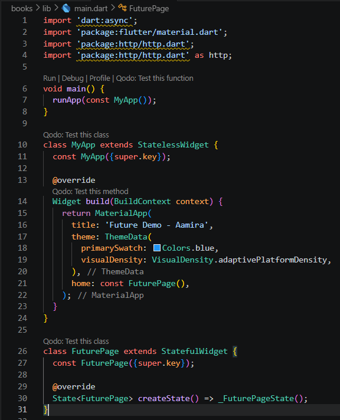

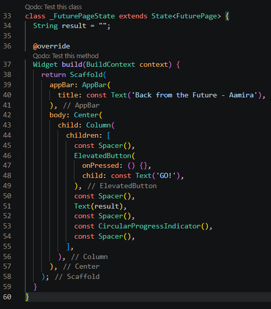

### Langkah 4: Tambah method getData()
Penambahan method berikut ke dalam class _FuturePageState yang berguna untuk mengambil data dari API Google Books.

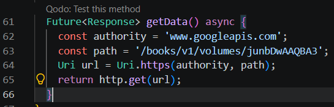

#### Soal 2

## Praktikum 2: Menggunakan await/async untuk menghindari callbacks
### Langkah 1: Buka file main.dart
Menambahkan tiga method berisi kode seperti berikut di dalam class _FuturePageState.

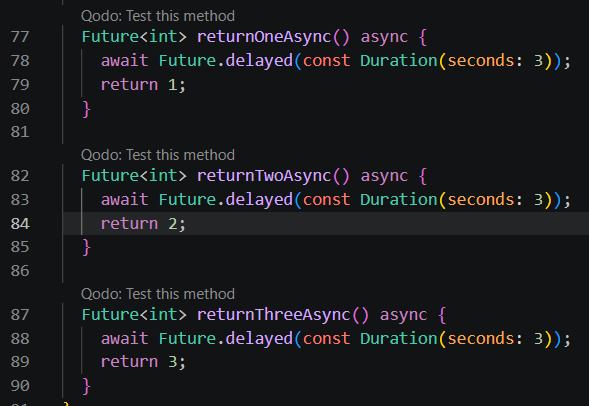

### Langkah 2: Tambah method count()
Lalu menambahkan lagi method ini di bawah ketiga method sebelumnya.

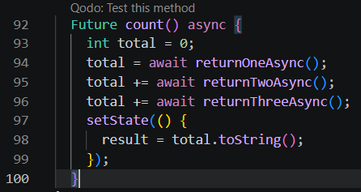

### Langkah 3: Panggil count()
Lakukan comment kode sebelumnya, ubah isi kode onPressed() menjadi seperti berikut.

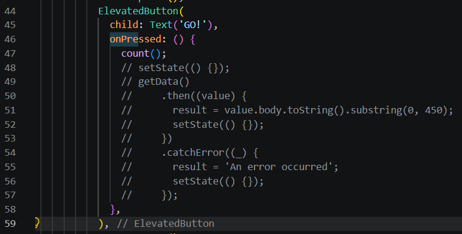

### Langkah 4: Run

#### Soal 4
- Jelaskan maksud kode langkah 1 dan 2 tersebut!

    Jawab:

    Kode pada **Langkah 1** bertujuan untuk membuat tiga fungsi asynchronous (returnOneAsync, returnTwoAsync, dan returnThreeAsync) yang masing-masing menyimulasikan proses tunggu selama 3 detik menggunakan Future.delayed sebelum mengembalikan nilai string. 

    Kemudian, pada **Langkah 2**, fungsi count() dibuat untuk menjalankan ketiga fungsi tersebut secara berurutan menggunakan kata kunci await dan metode .then(). Ketika fungsi count() dipicu, aplikasi akan memproses fungsi satu per satu hingga total waktu tunggu mencapai 9 detik, menjumlahkan nilai angka di setiap tahapnya hingga mencapai angka 6, lalu memperbarui tampilan layar aplikasi melalui perintah setState().

- Capture hasil praktikum Anda berupa GIF dan lampirkan di README. Lalu lakukan commit dengan pesan "W11: Soal 4".

    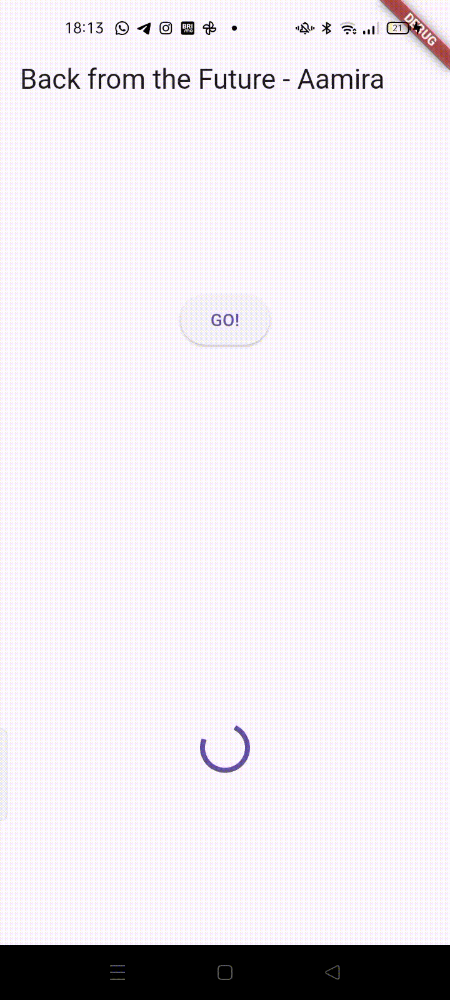

## Praktikum 3: Menggunakan Complemeter di Future
### Langkah 1: Buka main.dart
Impor package async.

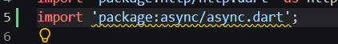

### Langkah 2: Tambahkan variabel dan method
Menambahkan variabel late dan method di class _FuturePageState.

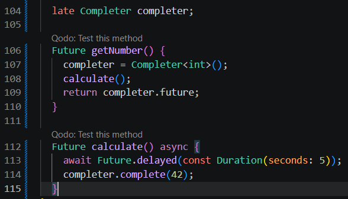

### Langkah 3: Ganti isi kode onPressed()
Menambahkan kode berikut pada fungsi onPressed(). Kode sebelumnya di comment.

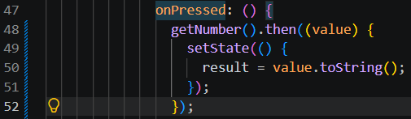

### Langkah 4: 
Run aplikasi. Hasilnya, setelah 5 detik, maka angka 42 akan tampil.

#### Soal 5
- Jelaskan maksud kode langkah 2 berikut!

    Jawab:

    Kode tersebut digunakan untuk membuat proses asynchronous dengan bantuan Completer. Pada method getNumber(), program membuat objek Completer<int> lalu menjalankan method calculate() dan mengembalikan future milik completer. Selanjutnya, pada method calculate(), program menunggu selama 5 detik menggunakan Future.delayed() untuk mensimulasikan proses yang membutuhkan waktu, seperti mengambil data dari server. Setelah 5 detik, method completer.complete(42) dijalankan untuk menyelesaikan Future dan mengirimkan nilai 42 sebagai hasil akhirnya.

- Capture hasil praktikum berupa GIF dan lampirkan di README. Lalu lakukan commit dengan pesan "W11: Soal 5".

    Jawab:

    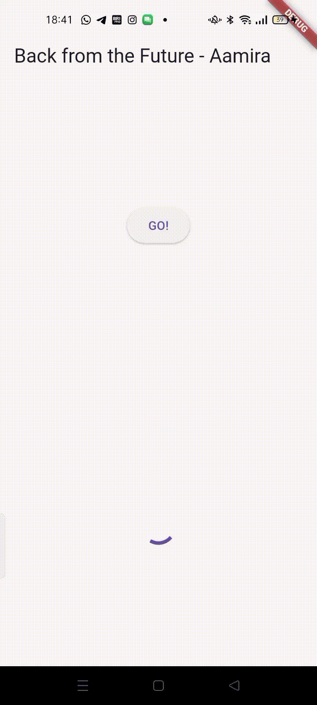

### Langkah 5: Ganti method calculate()
Mengganti isi code method calculate().

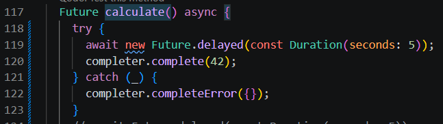

### Langkah 6: Pindah ke onPressed()
Ganti menjadi kode seperti berikut.

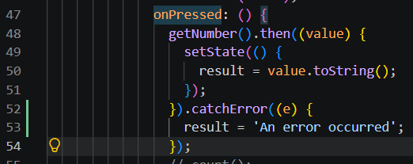

#### Soal 6
- Jelaskan maksud perbedaan kode langkah 2 dengan langkah 5-6 tersebut!

    Jawab:

    Pada langkah 2, method calculate() hanya menjalankan proses asynchronous dengan menunggu 5 detik lalu mengembalikan nilai 42 menggunakan completer.complete(42), sehingga Future selalu berhasil. Sedangkan pada langkah 5, kode ditambahkan try-catch untuk menangani kemungkinan error dengan completer.completeError(). Oleh karena itu, pada langkah 6 ditambahkan .catchError() di onPressed() agar aplikasi dapat menangkap error dan menampilkan pesan "An error occurred". Jadi, langkah 2 hanya menangani proses sukses, sedangkan langkah 5–6 sudah mendukung error handling.

- Capture hasil praktikum berupa GIF dan lampirkan di README. Lalu lakukan commit dengan pesan "W11: Soal 6".

    Jawab:

    

## Praktikum 4: Memanggil Future secara paralel
### Langkah 1: Buka file main.dart
Menambahkan method ini ke dalam class _FuturePageState

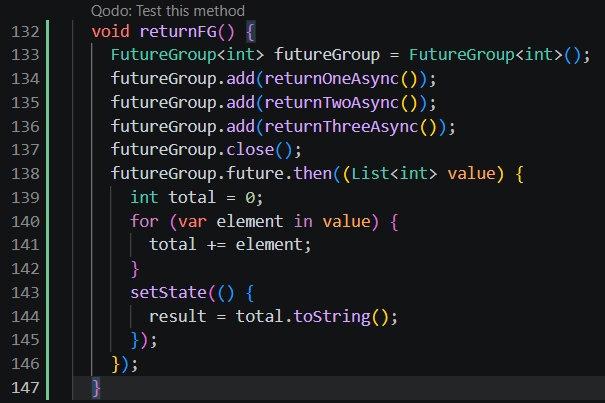

### Langkah 2: Edit onPressed()
Hapus atau comment kode sebelumnya, kemudian panggil method dari langkah 1 tersebut.

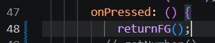

### Langkah 3: Run
Anda akan melihat hasilnya dalam 3 detik berupa angka 6 lebih cepat dibandingkan praktikum sebelumnya menunggu sampai 9 detik.

#### Soal 7
- Capture hasil praktikum Anda berupa GIF dan lampirkan di README. Lalu lakukan commit dengan pesan "W11: Soal 7".

    Jawab:

    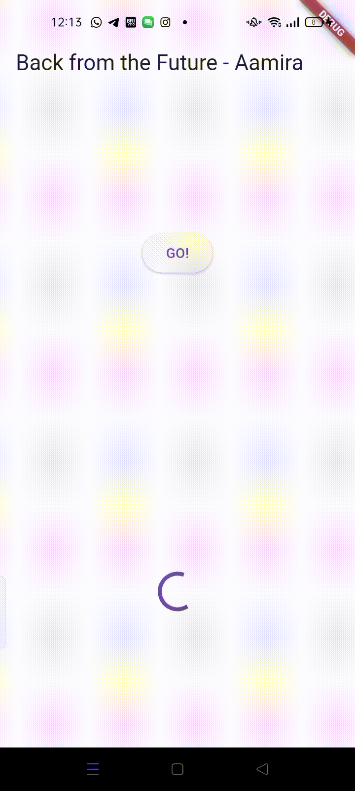

### Langkah 4: Ganti variabel futureGroup
Dapat menggunakan FutureGroup dengan Future.wait seperti kode berikut.

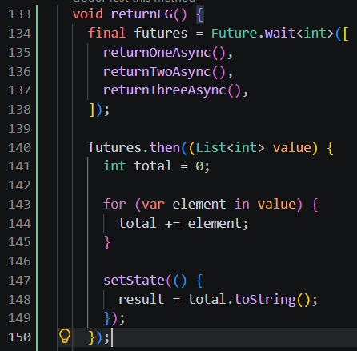

#### Soal 8
- Jelaskan maksud perbedaan kode  langkah 1 dan 4!

    Jawab:

    Perbedaan kode langkah 1 dan langkah 4 terletak pada cara menggabungkan beberapa proses asynchronous (Future). Pada langkah 1 digunakan FutureGroup, sehingga setiap Future harus ditambahkan satu per satu menggunakan add() lalu ditutup dengan close() agar dapat diproses. Sedangkan pada langkah 4 digunakan Future.wait() yang lebih sederhana karena cukup menuliskan semua Future dalam satu list tanpa perlu add() dan close(). Oleh karena itu, Future.wait() membuat kode menjadi lebih ringkas, mudah dibaca, dan lebih praktis digunakan.

## Praktikum 5: Menangani Respon Error pada Async Code

### Langkah 1: Buat file main.dart
Menambahkan method ini ke dalam class _FuturePageState

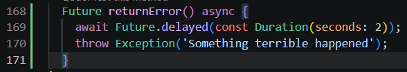

### Langkah 2: ElevatedButton
Ganti dengan kode berikut

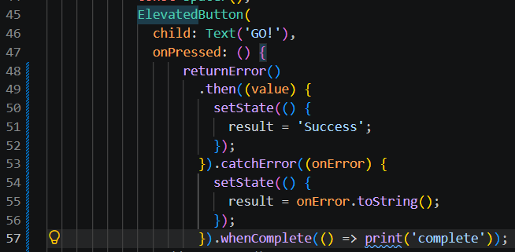

### Langkah 3: Run
Run dan klik tombol GO!

#### Soal 9
- Capture hasil praktikum Anda berupa GIF dan lampirkan di README. Lalu lakukan commit dengan pesan "W11: Soal 9".

    Jawab:

    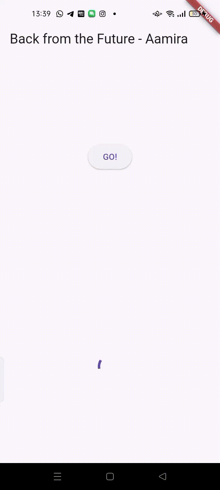

    Pada bagian debug console akan terlihat teks Complete.

    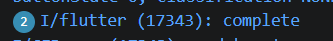

### Langkah 4: Tambah method handleError()
Menambahkan kode ini di dalam class _FutureStatePage

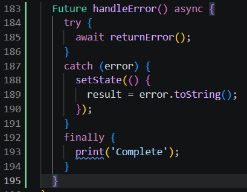

#### Soal 10
- Panggil method handleError() tersebut di ElevatedButton, lalu run. Apa hasilnya? Jelaskan perbedaan kode langkah 1 dan 4!

    Jawab:

    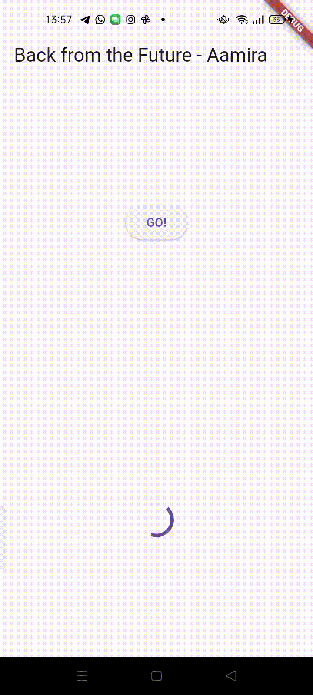

    Hasil dari kode tersebut adalah program akan menampilkan pesan error "Exception: Something terrible happened!" setelah menunggu sekitar 2 detik. Hal ini terjadi karena method returnError() sengaja menghasilkan error menggunakan throw Exception(). 
    
    Pada langkah 1, kode hanya membuat method untuk menghasilkan error tanpa penanganan khusus, sehingga jika dipanggil langsung program dapat mengalami error. Sedangkan pada langkah 4 ditambahkan method handleError() yang menggunakan try-catch-finally untuk menangani error tersebut. Bagian catch digunakan untuk menangkap dan menampilkan pesan error ke variabel result, sedangkan finally akan selalu dijalankan dan menampilkan tulisan "Complete" meskipun terjadi error.

## Praktikum 6: Menggunakan Future dengan StatefulWidget
### Langkah 1: install plugin geolocator
Menambahkan plugin geolocator dengan mengetik perintah berikut di terminal.

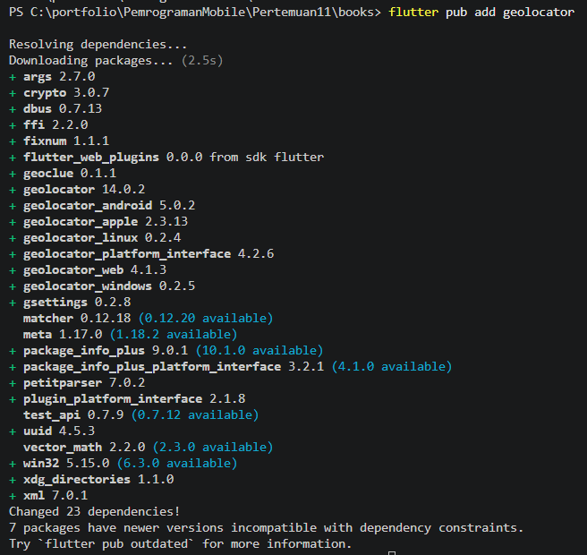

### Langkah 2: Tambah permission GPS
Karena menargetkan untuk platform Android, maka menambahkan baris kode berikut di file android/app/src/main/androidmanifest.xml

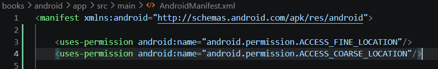

### Langkah 3: Buat file geolocation.dart
Menambahkan file baru ini di folder lib project.

### Langkah 4: Buat StatefulWidget
Membuat class LocationScreen di dalam file geolocation.dart

### Langkah 5: Isi kode geolocation.dart
#### Soal 11
- Tambahkan nama panggilan Anda pada tiap properti title.

    Jawab:

    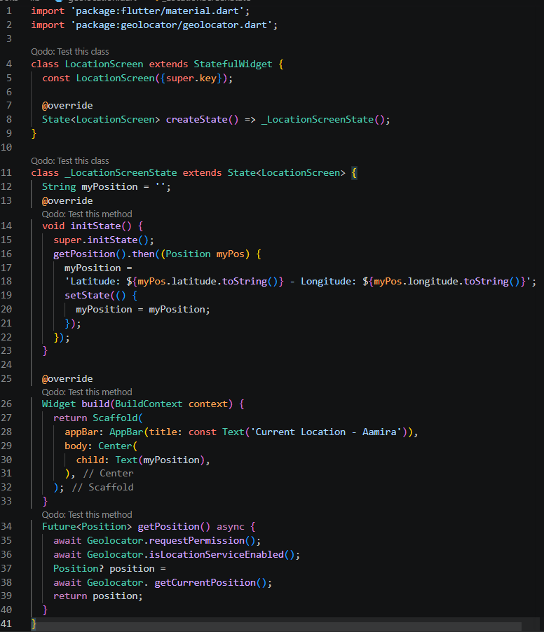

### Langkah 6: Edit main.dart
Memanggil screen baru tersebut di file main.

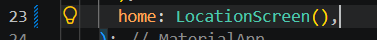

### Langkah 7: Run
Run project di device atau emulator (bukan browser).

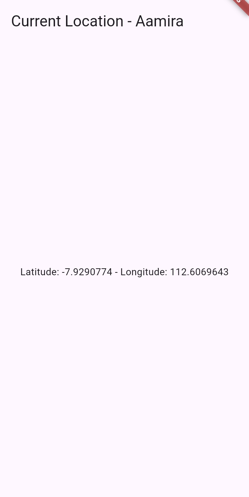

### Langkah 8: Tambahkan animasi loading
Menambahkan widget loading di file geolocation.dart

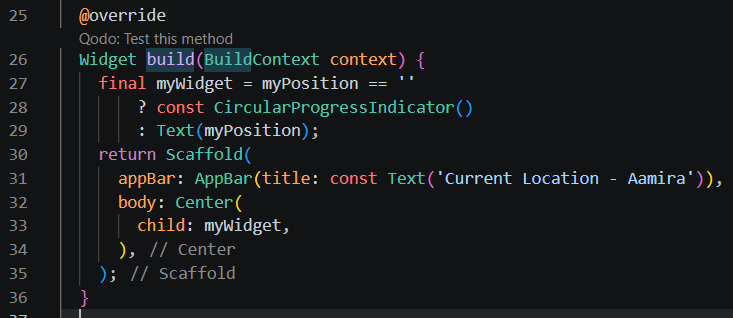

#### Soal 12
- Tambahkan delay pada method getPosition() dengan kode await Future.delayed(const Duration(seconds: 3));

    Jawab:

    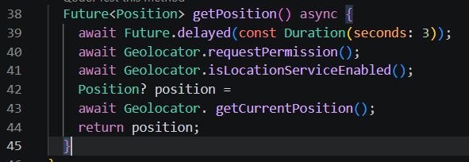

- Apakah Anda mendapatkan koordinat GPS ketika run di browser? Mengapa demikian?

    Jawab:

    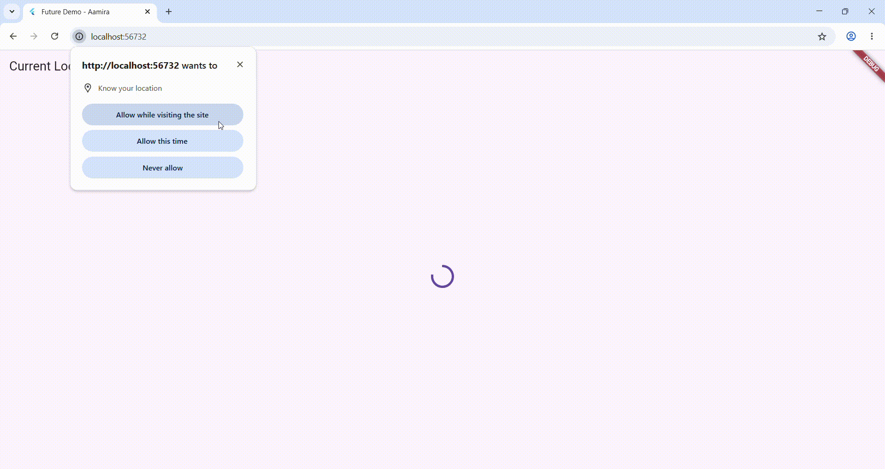

    Ya, saya tetap mendapatkan koordinat GPS saat dijalankan di browser karena browser yang digunakan mendukung fitur geolocation dan saya telah memberikan izin akses lokasi. Selain itu, perangkat yang digunakan memiliki layanan lokasi atau GPS yang aktif sehingga browser dapat mengambil koordinat lokasi dengan cukup akurat.

- Capture hasil praktikum berupa GIF dan lampirkan di README. Lalu lakukan commit dengan pesan "W11: Soal 12".

    Jawab:

    

## Praktikum 7: Manajemen Future dengan FutureBuilder
### Langkah 1: Modifikasi method getPosition()
Di file geolocation.dart, mengganti isi method dengan kode ini.

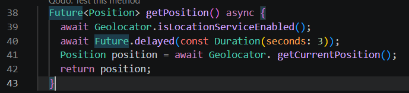

### Langkah 2: Tambah variabel
Menambah variabel berikut di class _LocationScreenState

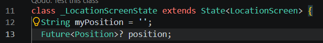

### Langkah 3: Tambah initState()
Menambahkan method berikut dan set variabel position

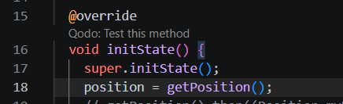

### Langkah 4: Edit method build()

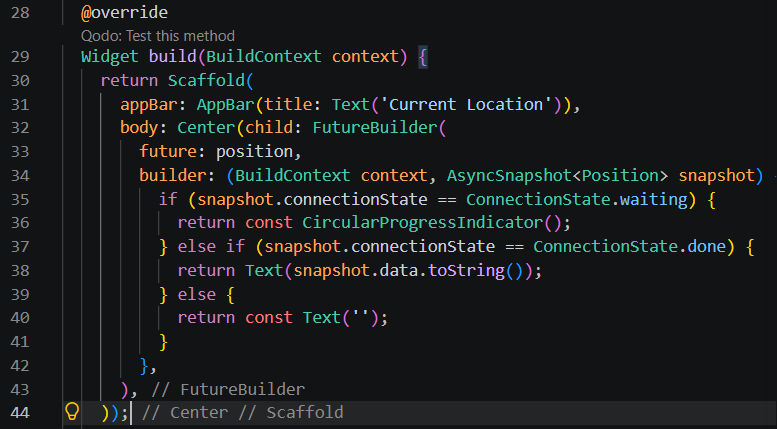

#### Soal 13
- Apakah ada perbedaan UI dengan praktikum sebelumnya? Mengapa demikian?

    Jawab:

    Iya, terdapat perbedaan antara praktikum 6 dan 7.

    Pada praktikum 6, pengelolaan state untuk mendeteksi lokasi GPS masih bersifat konvensional menggunakan setState(), sehingga kode cenderung lebih panjang karena harus melacak status loading secara manual. Pada Praktikum 7, penggunaan FutureBuilder memangkas kerumitan tersebut. Widget ini bertindak sebagai jembatan otomatis yang memantau perkembangan proses asinkron secara real-time dan langsung menyesuaikan tampilan berdasarkan statusnya (apakah masih memuat atau sudah selesai). 

- Capture hasil praktikum Anda berupa GIF dan lampirkan di README. Lalu lakukan commit dengan pesan "W11: Soal 13".

### Langkah 5: Tambah handling error
Penambahan kode berikut untuk menangani ketika terjadi error.

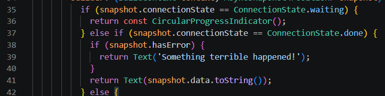

#### Soal 14
- Apakah ada perbedaan UI dengan langkah sebelumnya? Mengapa demikian?

    Jawab:

    Secara UI, aplikasi masih terlihat sama seperti sebelumnya karena tetap menampilkan loading indicator dan hasil koordinat lokasi. Namun, terdapat perubahan pada bagian pengelolaan error di dalam FutureBuilder.

    Pada versi sebelumnya, aplikasi hanya menangani kondisi proses loading dan data berhasil diperoleh. Akibatnya, jika terjadi kegagalan saat mengambil lokasi, aplikasi tidak menampilkan informasi apa pun kepada pengguna.

    Setelah ditambahkan kondisi snapshot.hasError, aplikasi kini dapat mendeteksi dan menampilkan pesan error ketika proses pengambilan lokasi mengalami masalah. Jadi, perubahan yang terjadi lebih berfokus pada peningkatan penanganan error agar aplikasi menjadi lebih informatif dan stabil.

- Capture hasil praktikum Anda berupa GIF dan lampirkan di README. Lalu lakukan commit dengan pesan "W11: Soal 14".

    

## Praktikum 8: Navigation route dengan Future Function
### Langkah 1: Buat file baru navigation_first.dart
Membuat file baru ini di project lib.

### Langkah 2: Isi kode navigation_first.dart
#### Soal 15
- Tambahkan nama panggilan Anda pada tiap properti title sebagai identitas pekerjaan Anda.
- Silakan ganti dengan warna tema favorit Anda.

     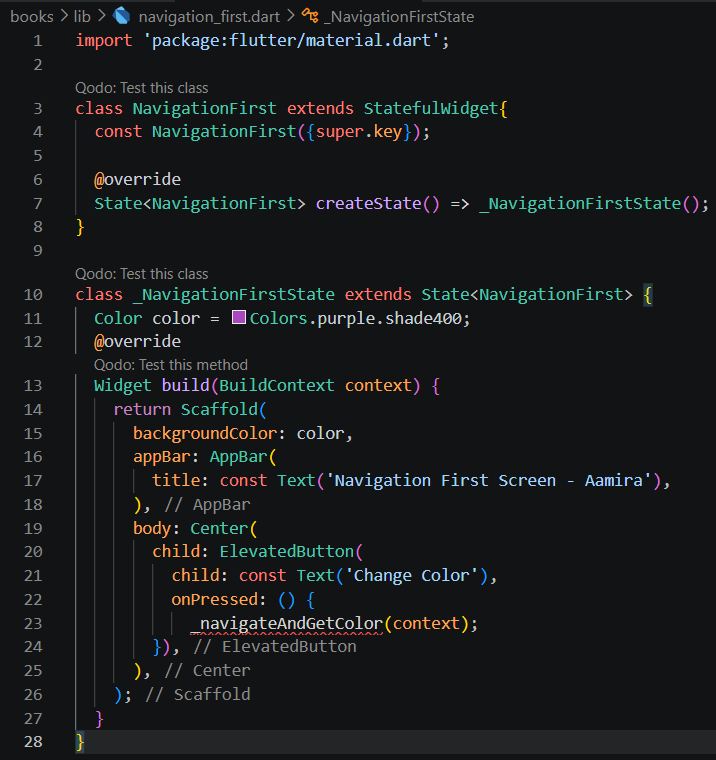

### Langkah 3: Tambah method di class _NavigationFirstState

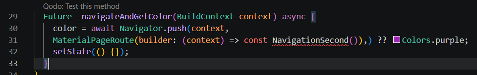

### Langkah 4: Buat file baru navigation_second.dart
Membuat file baru ini di project lib.

### Langkah 5: Buat class NavigationSecond dengan StatefulWidget

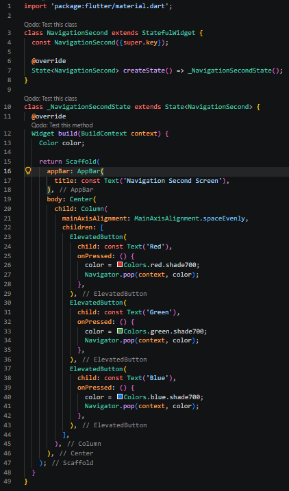

### Langkah 6: Edit main.dart
Edit properti home.

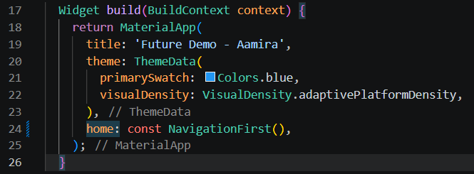

### Langkah 8: Run
#### Soal 16
- Cobalah klik setiap button, apa yang terjadi ? Mengapa demikian ?

    Jawab:

    Ketika setiap button diklik, aplikasi akan menutup halaman NavigationSecond dan kembali ke halaman NavigationFirst. Bersamaan dengan itu, warna yang dipilih akan dikirim menggunakan Navigator.pop(context, color).

    Di halaman NavigationFirst, nilai warna tersebut diterima lalu disimpan ke variabel color. Setelah setState() dijalankan, background halaman otomatis diperbarui sesuai warna yang dipilih pengguna. Karena itu, tampilan halaman pertama langsung berubah menjadi warna merah, hijau, atau biru sesuai button yang ditekan.

- Gantilah 3 warna pada langkah 5 dengan warna favorit Anda!

    Jawab:

    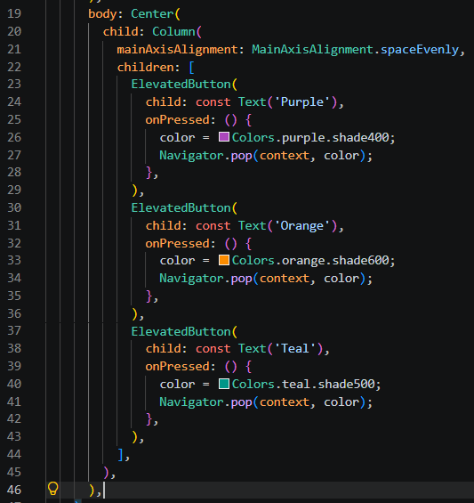

- Capture hasil praktikum Anda berupa GIF dan lampirkan di README. Lalu lakukan commit dengan pesan "W11: Soal 16".

    

## Praktikum 9: Memanfaatkan async/await dengan Widget Dialog
### Langkah 1: Buat file baru navigation_dialog.dart
Membuat file dart baru di folder lib project Anda.

### Langkah 2: Isi kode navigation_dialog.dart

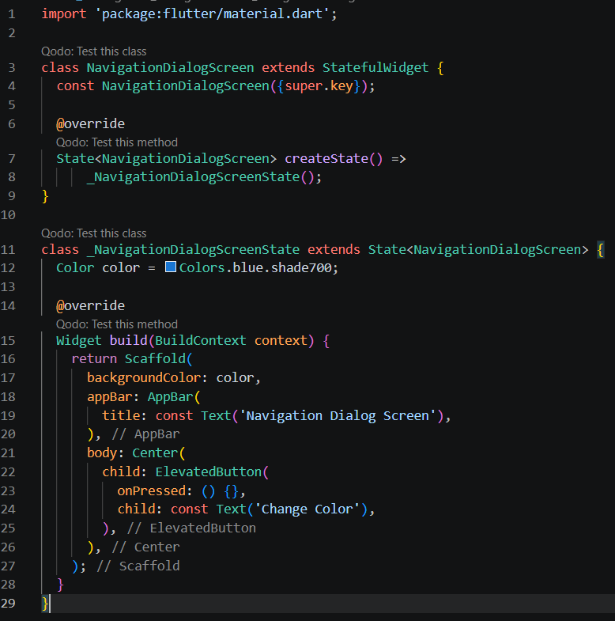

### Langkah 3: Tambah method async

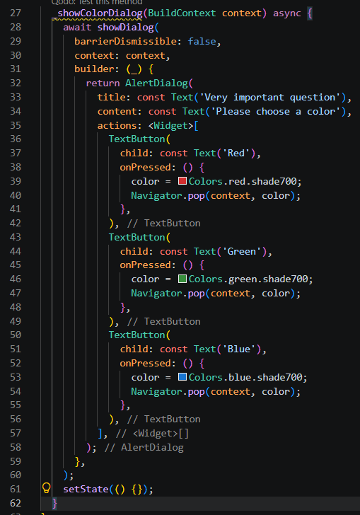

### Langkah 4: Panggil method di ElevatedButton

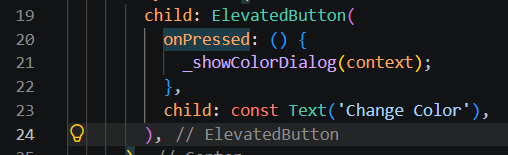

### Langkah 5: Edit main.dart
Ubah properti home.

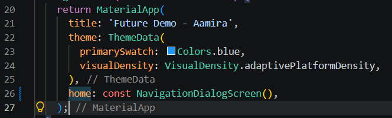

### Langkah 6: Run

#### Soal 17
- Cobalah klik setiap button, apa yang terjadi ? Mengapa demikian ?

    Jawab:

    Ketika tombol Change Color ditekan, aplikasi akan menampilkan sebuah AlertDialog yang berisi beberapa opsi warna. Setelah memilih salah satu warna, dialog akan otomatis ditutup dan warna latar belakang halaman berubah sesuai warna yang dipilih. Proses ini terjadi karena setiap tombol pada dialog mengirimkan nilai warna ke halaman utama melalui Navigator.pop(context, color). Nilai tersebut kemudian disimpan pada variabel color, dan fungsi setState() dipanggil untuk memperbarui tampilan sehingga perubahan warna background dapat langsung terlihat.

- Gantilah 3 warna pada langkah 3 dengan warna favorit Anda!

    Jawab:

    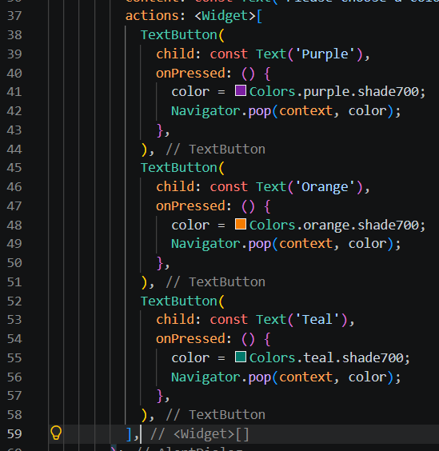

- Capture hasil praktikum Anda berupa GIF dan lampirkan di README. Lalu lakukan commit dengan pesan "W11: Soal 17".

    

    

