# Laporan Praktikum #03 - Pengantar Bahasa Pemrograman Dart Bagian 2

Nama: Aamira Faheema Ghania  
NIM: 244107060081                  
Kelas: SIB-2D     
Absen: 01                             

## Praktikum 1: Menerapkan Control Flows ("if/else")
#### Langkah 1:
Ketik atau salin kode program berikut ke dalam fungsi main().

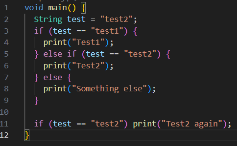

#### Langkah 2:
Silakan coba eksekusi (Run) kode pada langkah 1 tersebut. Apa yang terjadi? Jelaskan!

Jawab:

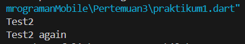

Program menampilkan "Test2" dan "Test2 again". Hal ini terjadi karena variabel test berisi nilai "test2", sehingga kondisi pertama (test == "test1") bernilai salah, lalu kondisi else if (test == "test2") bernilai benar dan mencetak "Test2". Setelah itu, terdapat pengecekan if kedua yang juga memeriksa apakah sama dengan "test2", dan karena benar, maka program kembali mencetak "Test2 again". 

#### Langkah 3:
Tambahkan kode program berikut, lalu coba eksekusi (Run) kode Anda.

Jawab:

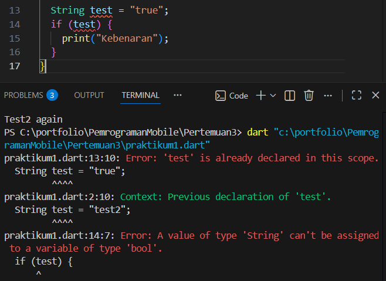

Terjadi error (compile error) karena kondisi pada if harus berupa boolean, sedangkan variabel test bertipe String, bukan boolean. 

Perbaikan:

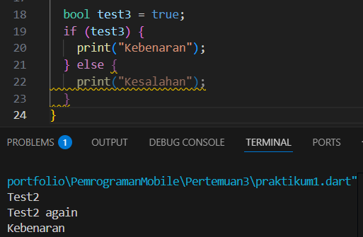

Hasilnya program menampilkan "Kebenaran", karena nilai variabel test adalah true, sehingga kondisi pada if terpenuhi dan blok tersebut dijalankan, sedangkan bagian else tidak dieksekusi.

## Praktikum 2: Menerapkan Perulangan "while" dan "do-while"
#### Langkah 1:
Ketik atau salin kode program berikut ke dalam fungsi main().

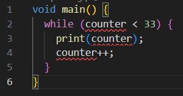

#### Langkah 2:
Silakan coba eksekusi (Run) kode pada langkah 1 tersebut. Apa yang terjadi? Jelaskan! Lalu perbaiki jika terjadi error.

Jawab:

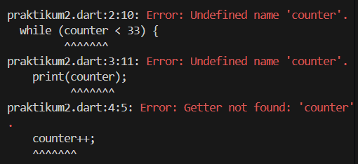

Program pada langkah 1 ketika di run akan terjadi error karena variabel counter belum dideklarasikan dan belum diberi nilai awal.

Perbaikan:

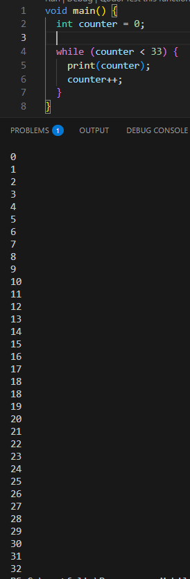

Program menampilkan angka dari 0 sampai 32. Hal ini karena perulangan berjalan selama nilai counter kurang dari 33, dan setiap iterasi nilai counter bertambah 1 hingga akhirnya mencapai 33 dan perulangan berhenti.

#### Langkah 3:
Tambahkan kode program berikut, lalu coba eksekusi (Run) kode Anda.
Apa yang terjadi ? Jika terjadi error, silakan perbaiki namun tetap menggunakan do-while.

Jawab:

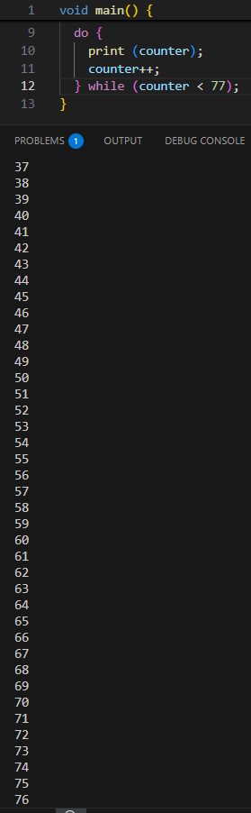

Perulangan menampilkan angka dari 0 sampai 76. Perulangan while mencetak angka 0-32, lalu setelah counter bernilai 33, perulangan do-while melanjutkan mencetak angka 33-76. Ketika counter mencapai 77, perulangan berhenti.

## Praktikum 3: Menerapkan Perulangan "for" dan "break-continue"
#### Langkah 1:
Ketik atau salin kode program berikut ke dalam fungsi main().

#### Langkah 2:
Silakan coba eksekusi (Run) kode pada langkah 1 tersebut. Apa yang terjadi? Jelaskan! Lalu perbaiki jika terjadi error.

Jawab:

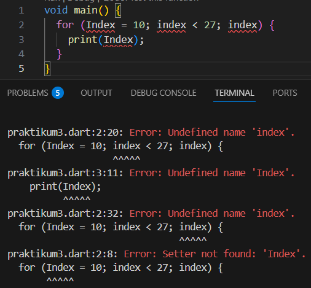

Saat kode program tersebut dieksekusi akan terjadi error karena variabel Index/index belum dideklarasikan, penulisan huruf besar-kecil tidak konsisten (Index dan index dianggap berbeda), tidak ada operator increment (index++).

Perbaikan:

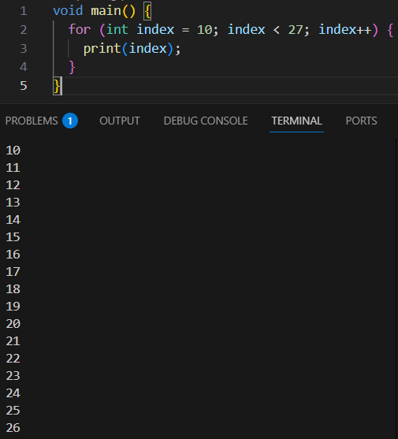

Program tersebut menampilkan angka dari 10 sampai 26, karena perulangan berjalan selama nilai index kurang dari 27.

#### Langkah 3:
Tambahkan kode program berikut di dalam for-loop, lalu coba eksekusi (Run) kode Anda.
Apa yang terjadi ? Jika terjadi error, silakan perbaiki namun tetap menggunakan for dan break-continue.

Jawab:

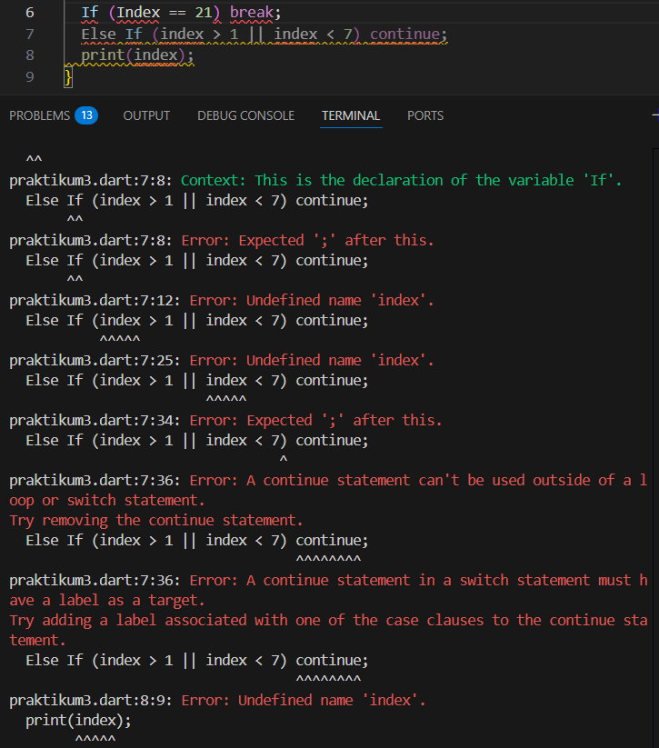

Kode tersebut menghasilkan error karena penulisan If dan Else if harus menggunakan huruf kecil (if, else if) serta penggunaan variabel harus konsisten (index, bukan campuran Index dan index).

Perbaikan:

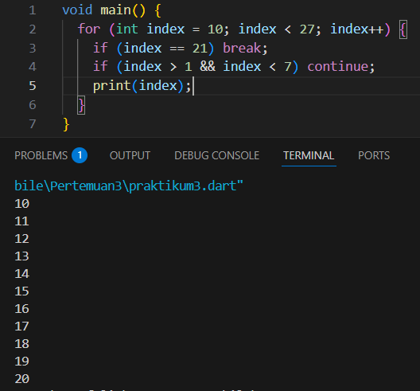

Setelah diperbaiki, program tersebut menampilkan angka 10 sampai 20. Perulangan dimulai dari 10 dan terus bertambah hingga kurang dari 27. Kondisi if (index > 1 && index < 7) tidak pernah terpenuhi karena nilai index berada di antara 10-26, sehingga continue tidak pernah dijalankan. Ketika index mencapai 21, perintah break menghentikan perulangan. Oleh karena itu, angka yang tercetak hanya dari 10 hingga 20.

## Tugas Praktikum
#### Soal No 2:
Buatlah sebuah program yang dapat menampilkan bilangan prima dari angka 0 sampai 201 menggunakan Dart. Ketika bilangan prima ditemukan, maka tampilkan nama lengkap dan NIM Anda.

Jawab:

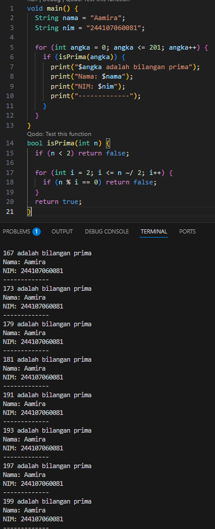

Program melakukan perulangan dari 0 sampai 201. Setiap angka dicek menggunakan fungsi isPrima(). Jika angka tersebut adalah bilangan prima, maka program akan menampilkan angka tersebut beserta nama lengkap dan NIM.

