# Laporan Praktikum #04 - Pengantar Bahasa Pemrograman Dart Bagian 3

Nama: Aamira Faheema Ghania  
NIM: 244107060081                  
Kelas: SIB-2D     
Absen: 01                             

## Praktikum 1: Eksperimen Tipe Data List
#### Langkah 1:
Ketik atau salin kode program berikut ke dalam void main().

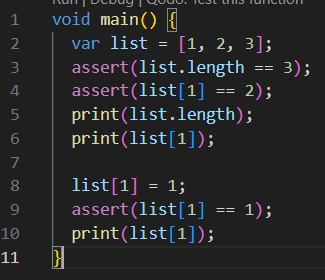

#### Langkah 2:
Silakan coba eksekusi (Run) kode pada langkah 1 tersebut. Apa yang terjadi? Jelaskan!

Jawab:

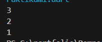

Saat kode dijalankan, program membuat list yang berisi tiga elemen yaitu [1,2,3]. Program kemudian menggunakan assert untuk memeriksa bahwa panjang list adalah 3 dan nilai pada indeks ke-1 adalah 2. Karena kondisi tersebut benar, program akan mencetak panjang list yaitu 3 dan nilai elemen pada indeks ke-1 yaitu 2. Setelah itu, nilai pada indeks ke-1 diubah dari 2 menjadi 1, lalu dicek kembali dengan assert. Karena nilainya sudah sesuai, program mencetak nilai terbaru yaitu 1. Sehingga output yang dihasilkan adalah 3, 2, dan 1.

#### Langkah 3:
Ubah kode pada langkah 1 menjadi variabel final yang mempunyai index = 5 dengan default value = null. Isilah nama dan NIM Anda pada elemen index ke-1 dan ke-2. Lalu print dan capture hasilnya.

Apa yang terjadi ? Jika terjadi error, silakan perbaiki.

Jawab:

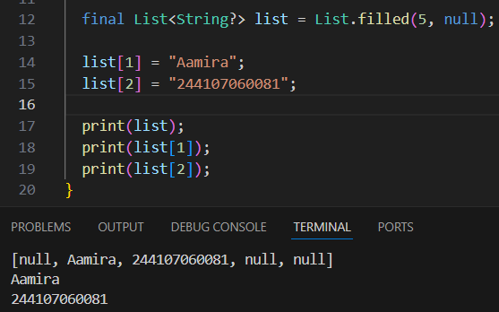

Pada kode tersebut dibuat list dengan panjang 5 menggunakan List.filled(5, null) sehingga semua elemen awalnya bernilai null. Variabel list menggunakan final, artinya variabelnya tidak bisa diganti dengan list baru, tetapi isi elemennya masih bisa diubah. Kemudian elemen pada index ke-1 diisi dengan nama "Aamira" dan index ke-2 diisi dengan NIM "244107060081". Saat program dijalankan, program menampilkan seluruh isi list serta nilai pada index ke-1 dan ke-2.

## Praktikum 2: Eksperimen Tipe Data Set
#### Langkah 1:
Ketik atau salin kode program berikut ke dalam fungsi main().

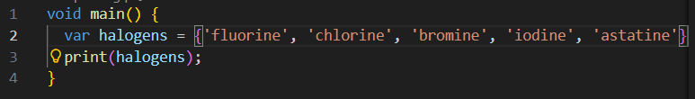

#### Langkah 2:
Silakan coba eksekusi (Run) kode pada langkah 1 tersebut. Apa yang terjadi? Jelaskan! Lalu perbaiki jika terjadi error.

Jawab:

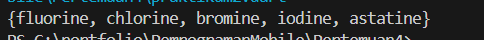

Ketika kode tersebut dijalankan, program akan membuat sebuah Set bernama halogens yang berisi lima elemen. Tanda kurung kurawal {} digunakan untuk mendeklarasikan Set di Dart. Saat perintah print(halogens) dijalankan, seluruh isi set akan ditampilkan di layar.

#### Langkah 3:
Tambahkan kode program berikut, lalu coba eksekusi (Run) kode Anda.

Apa yang terjadi ? Jika terjadi error, silakan perbaiki namun tetap menggunakan ketiga variabel tersebut. Tambahkan elemen nama dan NIM Anda pada kedua variabel Set tersebut dengan dua fungsi berbeda yaitu .add() dan .addAll(). Untuk variabel Map dihapus.

Dokumentasikan code dan hasil di console, lalu buat laporannya.

Jawab:

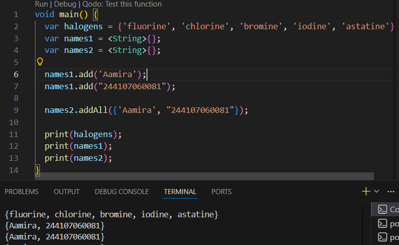

Setelah kode dijalankan, program membuat tiga Set yaitu halogens, names1, dan names2. Variabel names1 ditambahkan elemen nama dan NIM menggunakan fungsi .add() yang menambahkan satu elemen setiap kali pemanggilan. Sedangkan names2 menggunakan fungsi .addAll() yang dapat menambahkan beberapa elemen sekaligus dalam bentuk koleksi. Program kemudian mencetak isi ketiga Set tersebut.

## Praktikum 3: Eksperimen Tipe Data Maps
#### Langkah 1:
Ketik atau salin kode program berikut ke dalam fungsi main().

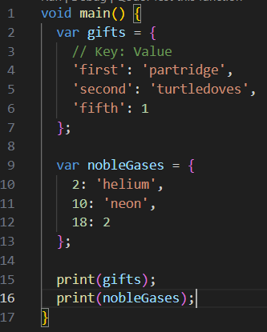

#### Langkah 2:
Silakan coba eksekusi (Run) kode pada langkah 1 tersebut. Apa yang terjadi? Jelaskan! Lalu perbaiki jika terjadi error.

Jawab:

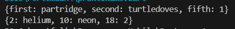

Saat kode dijalankan, program membuat dua Map yaitu gifts dan nobleGases. Map adalah struktur data yang menyimpan pasangan key: value. Pada variabel gifts, key bertipe String seperti 'first', 'second', dan 'fifth', sedangkan pada nobleGases key bertipe int seperti 2, 10, dan 18. Program kemudian menampilkan isi kedua Map tersebut menggunakan print().

#### Langkah 3:
Tambahkan kode program berikut, lalu coba eksekusi (Run) kode Anda.

Apa yang terjadi ? Jika terjadi error, silakan perbaiki.

Tambahkan elemen nama dan NIM Anda pada tiap variabel di atas (gifts, nobleGases, mhs1, dan mhs2). Dokumentasikan hasilnya dan buat laporannya!

Jawab:

Hasil penambahan kode serta perbaikan error:

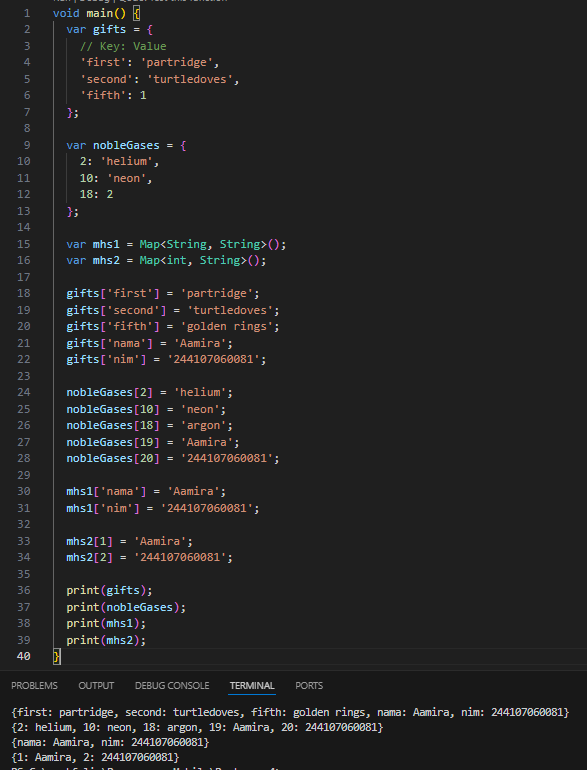

Setelah kode dijalankan, program membuat empat Map yaitu gifts, nobleGases, mhs1, dan mhs2. Beberapa nilai pada gifts dan nobleGases diperbarui menggunakan indeks key yang sama, sehingga nilainya berubah. Selain itu, ditambahkan elemen nama (Aamira) dan NIM (244107060081) pada setiap Map. Program kemudian menampilkan seluruh isi Map menggunakan print().

## Praktikum 4: Eksperimen Tipe Data List: Spread dan Control-flow Operators
#### Langkah 1:
Ketik atau salin kode program berikut ke dalam fungsi main().

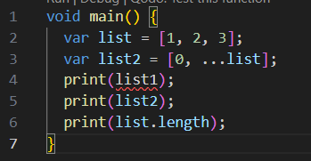

#### Langkah 2:
Silakan coba eksekusi (Run) kode pada langkah 1 tersebut. Apa yang terjadi? Jelaskan! Lalu perbaiki jika terjadi error.

Jawab:

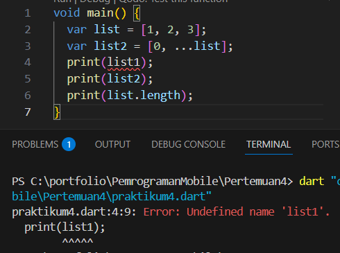

Ketika kode pada langkah 1 dijalankan, akan terjadi error. Penyebabnya adalah karena variabel list1 tidak pernah dideklarasikan di dalam program. Variabel yang ada hanya list dan list2. Akibatnya, Dart akan menampilkan error seperti "Undefined name 'list1'".

Perbaikan Kode:

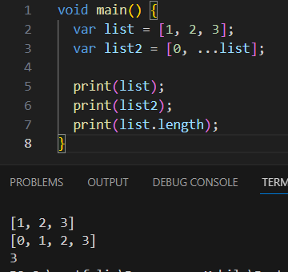

Error terjadi karena variabel yang dipanggil tidak ada (list1). Setelah diperbaiki menjadi list, program dapat dijalankan dengan benar.

#### Langkah 3:
Tambahkan kode program berikut, lalu coba eksekusi (Run) kode Anda.

list1 = [1, 2, null];

print(list1);

var list3 = [0, ...?list1];

print(list3.length);

Apa yang terjadi ? Jika terjadi error, silakan perbaiki.

Tambahkan variabel list berisi NIM Anda menggunakan Spread Operators. Dokumentasikan hasilnya dan buat laporannya!

Jawab:

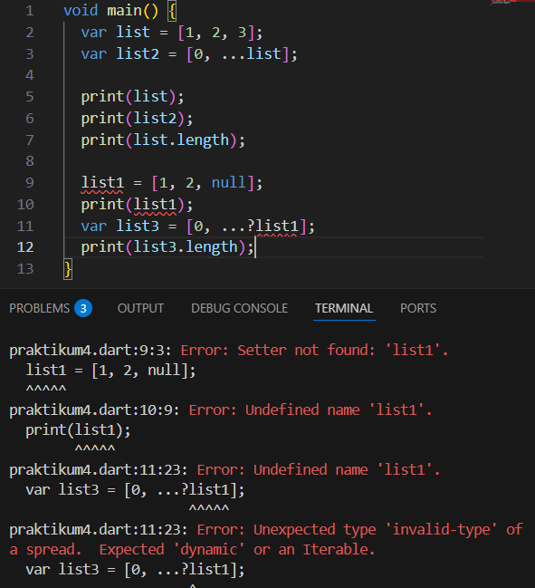

Saat kode tersebut dijalankan akan menghasilkan error karena variabel list1 belum dideklarasikan. Dart akan menampilkan error "Undefined name 'list1'".

Hasil penambahan serta perbaikan kode:

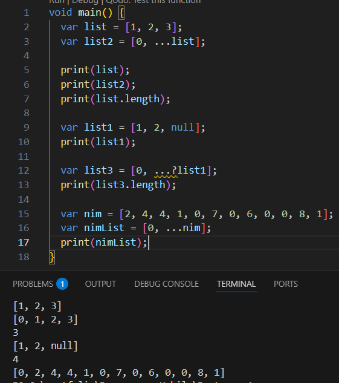

Setelah variabel list1 dideklarasikan, program dapat dijalankan tanpa error. Spread operator (...) digunakan untuk menyalin semua elemen dari list ke list2 sehingga menghasilkan [0, 1, 2, 3]. Kemudian list1 berisi [1, 2, null] dan digunakan pada list3 dengan null-aware spread operator (...?), sehingga elemennya tetap dimasukkan karena list1 tidak bernilai null dan panjang list3 menjadi 4. Lalu NIM 244107060081 dimasukkan ke dalam list [2, 4, 4, 1, 0, 7, 0, 6, 0, 0, 8, 1] dan digabungkan menggunakan spread operator sehingga menghasilkan [0, 2, 4, 4, 1, 0, 7, 0, 6, 0, 0, 8, 1].

#### Langkah 4:
Tambahkan kode program berikut, lalu coba eksekusi (Run) kode Anda.

var nav = ['Home', 'Furniture', 'Plants', if (promoActive) 'Outlet'];

print(nav);

Apa yang terjadi ? Jika terjadi error, silakan perbaiki.

Tambahkan variabel list berisi NIM Anda menggunakan Spread Operators. Dokumentasikan hasilnya dan buat laporannya!

Jawab:

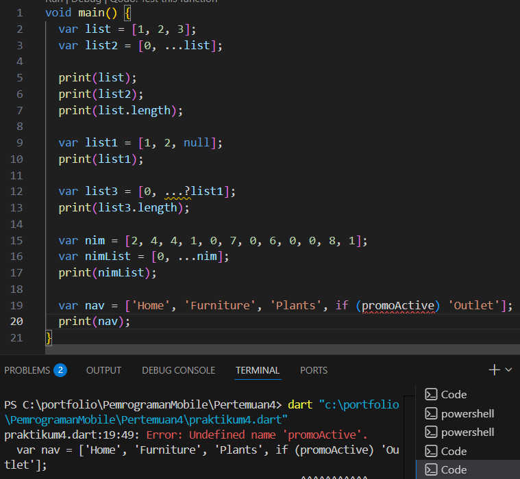

Saat kode tersebut dijalankan akan menghasilkan error karena variabel promoActive belum dideklarasikan. Dart memerlukan deklarasi variabel sebelum digunakan.

Hasil perbaikan kode serta jika promoActive = true

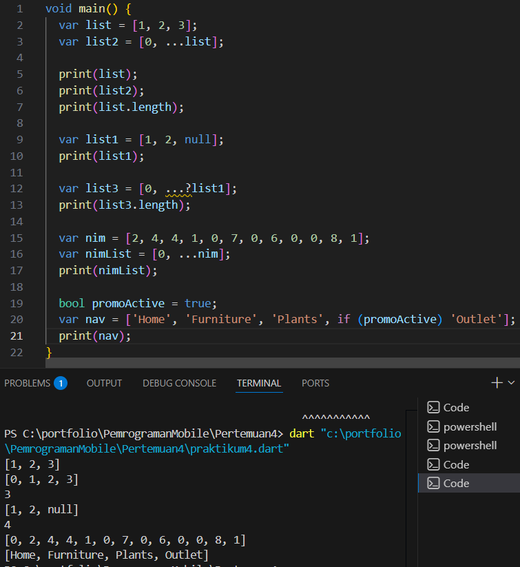

Perbaikan kode: Menambahkan deklarasi variabel promoActive. 

Hasil jika promoActive = true: Karena promoActive bernilai true, maka 'Outlet' ditambahkan ke dalam list.

Jika promoActive = false

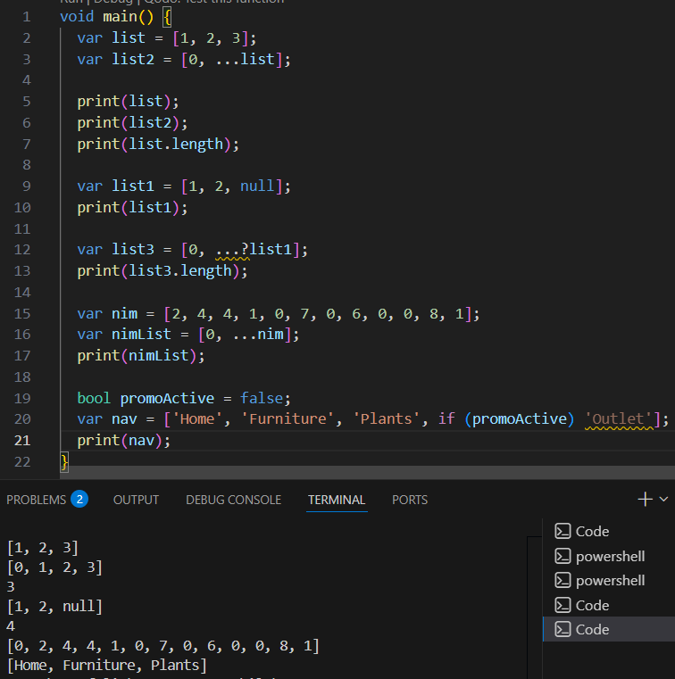

Karena promoActive bernilai false, maka 'Outlet' tidak dimasukkan ke dalam list.

#### Langkah 5:
Tambahkan kode program berikut, lalu coba eksekusi (Run) kode Anda.

var nav2 = ['Home', 'Furniture', 'Plants', if (login case 'Manager') 'Inventory'];

print(nav2);

Apa yang terjadi ? Jika terjadi error, silakan perbaiki. Tunjukkan hasilnya jika variabel login mempunyai kondisi lain.

Jawab:

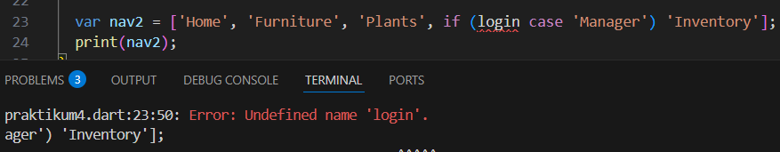

Saat kode tersebut dijalankan menghasilkan error karena variabel login belum dideklarasikan.

Perbaikan kode:

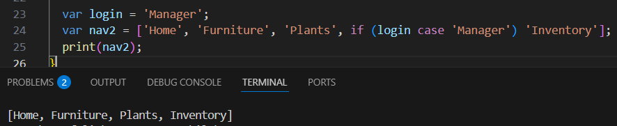

Perbaikan dilakukan dengan menambahkan deklarasi variabel login. 

Hasil jika login mempunyai kondisi lain:

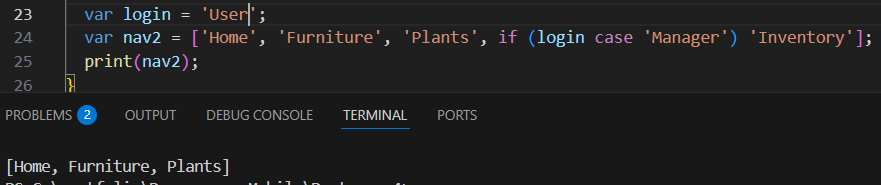

Elemen 'Inventory' hanya akan muncul di list jika nilai login adalah 'Manager', sedangkan di kode tersebut nilai login bukan 'Manager', maka 'Inventory' tidak ditambahkan ke dalam list.

#### Langkah 6:
Tambahkan kode program berikut, lalu coba eksekusi (Run) kode Anda.

var listOfInts = [1, 2, 3];

var listOfStrings = ['#0', for (var i in listOfInts) '#$i'];

assert(listOfStrings[1] == '#1');

print(listOfStrings);

Apa yang terjadi ? Jika terjadi error, silakan perbaiki. Jelaskan manfaat Collection For dan dokumentasikan hasilnya.

Jawab:

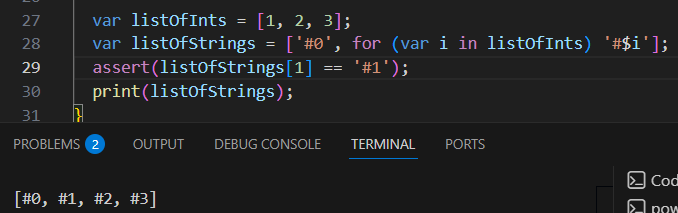

Saat kode tersebut dijalankan, program tidak menghasilkan error. Kode tersebut menunjukkan penggunaan Collection For pada Dart untuk menghasilkan list baru dari list yang sudah ada. Hasilnya adalah list [#0, #1, #2, #3], di mana angka dari listOfInts diubah menjadi string dengan format tertentu.

Collection For digunakan untuk membuat atau memodifikasi isi koleksi (seperti list) dengan cara yang lebih ringkas.

## Praktikum 5: Eksperimen Tipe Data Records
#### Langkah 1:
Ketik atau salin kode program berikut ke dalam fungsi main().

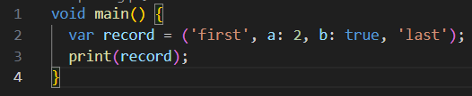

#### Langkah 2:
Silakan coba eksekusi (Run) kode pada langkah 1 tersebut. Apa yang terjadi? Jelaskan! Lalu perbaiki jika terjadi error.

Jawab:

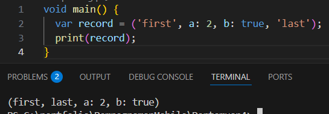

Ketika kode pada langkah 1 dijalankan, tidak terjadi error. Kode tersebut membuat sebuah record di Dart yang berisi beberapa nilai dalam satu variabel. Record record memiliki dua positional field yaitu 'first' dan 'last', serta dua named field yaitu a: 2 dan b: true. Positional field adalah nilai tanpa nama, sedangkan named field memiliki nama yang jelas. Ketika dijalankan, program menampilkan seluruh isi record tersebut.

#### Langkah 3:
Tambahkan kode program berikut di luar scope void main(), lalu coba eksekusi (Run) kode Anda.

Apa yang terjadi ? Jika terjadi error, silakan perbaiki. Gunakan fungsi tukar() di dalam main() sehingga tampak jelas proses pertukaran value field di dalam Records.

Jawab:

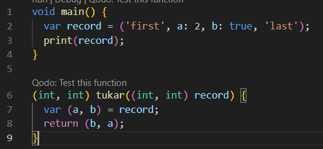

Kode fungsi tersebut tidak menimbulkan error ketika diletakkan di luar main(), karena Dart memperbolehkan deklarasi fungsi di luar fungsi utama. 

Penggunaan di dalam main()

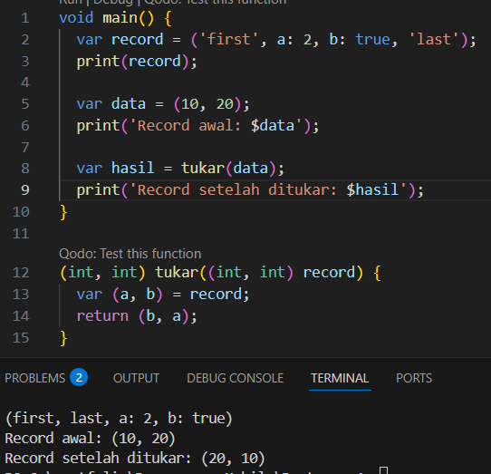

Fungsi tukar() menerima sebuah record berisi dua angka, lalu mmenggunakan destructuring untuk mengambil nilainya ke variabel a dan b. Nilai tersebut kemudian dikembalikan dalam urutan terbalik (b, a), sehingga nilai pada record tertukar posisinya saat ditampilkan di dalam main().

#### Langkah 4:
Tambahkan kode program berikut di dalam scope void main(), lalu coba eksekusi (Run) kode Anda.

Apa yang terjadi ? Jika terjadi error, silakan perbaiki. Inisialisasi field nama dan NIM Anda pada variabel record mahasiswa di atas. Dokumentasikan hasilnya dan buat laporannya!

Jawab:

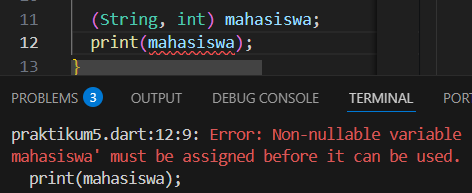

Saat kode tersebut dijalankan akan terjadi error karena variabel mahasiswa belum diinisialisasi tetapi sudah dipanggil. Dalam Dart, variabel dengan tipe non-nullable harus diberi nilai sebelum digunakan.

Perbaikan kode:

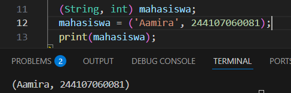

Pada kode tersebut, variabel mahasiswa menyimpan dua nilai yaitu nama (String) dan NIM (int). Setelah variabel diinisialisasi dengan data mahasiswa, perintah print(mahasiswa) akan menampilkan isi record tersebut.

#### Langkah 5:
Tambahkan kode program berikut di dalam scope void main(), lalu coba eksekusi (Run) kode Anda.

Apa yang terjadi ? Jika terjadi error, silakan perbaiki. Gantilah salah satu isi record dengan nama dan NIM Anda, lalu dokumentasikan hasilnya dan buat laporannya!

Jawab:

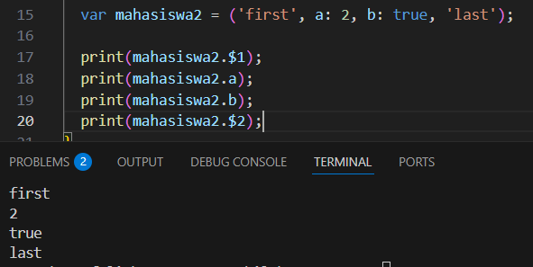

Saat kode dijalankan, program tidak menghasilkan error. Pada Dart, nilai dalam record dapat diakses dengan dua cara: Positional field menggunakan $!, $2, dan seterusnya. Named field menggunakan nama field seperti .a atau .b.

Kode setelah diganti dengan nama dan NIM:

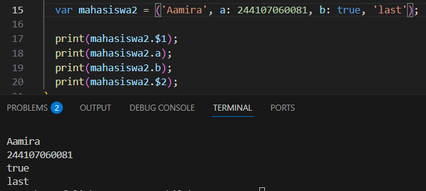

Kode tersebut membuat sebuah record dengan dua positional field serta dua named field. Nilai pada record dapat diakses menggunakan $ untuk positional field dan menggunakan nama field untuk named field. Setelah salah satu isi record diganti dengan nama dan NIM, program akan menampilkan nilai tersebut sesuai posisi field yang diakses.

## Tugas Praktikum
#### No 2:
Jelaskan yang dimaksud Functions dalam bahasa Dart!

Jawab:

Function adalah blok kode yang digunakan untuk menjalankan suatu tugas tertentu dan dapat dipanggil kembali ketika diperlukan. Function membantu membuat program lebih terstruktur, mudah dibaca, dan dapat digunakan kembali.

#### No 3:
Jelaskan jenis-jenis parameter di Functions beserta contoh sintaksnya!

Jawab:

1. Required Parameter (Positional Parameter): Parameter yang wajib diisi saat fungsi dipanggil.

    Contoh sintaks:

    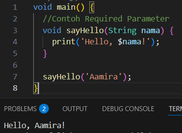

2. Optional Positional Parameter: Parameter tambahan yang tidak wajib diisi dan ditulis dalam tanda [].

    Contoh sintaks:

    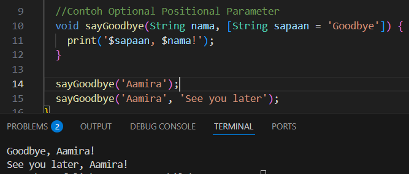

3. Named Parameter: Parameter menggunakan nama dan ditulis dalam {}.

    Contoh sintaks:

    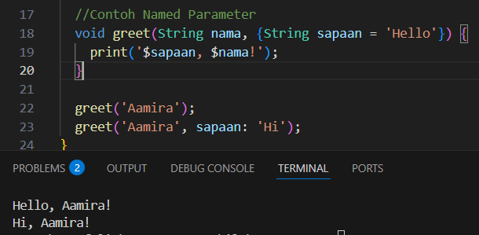

4. Required Named Parameter: Ini adalah named parameter yang wajib diisi dengan menambahkan keyword required.

    Contoh sintaks:

    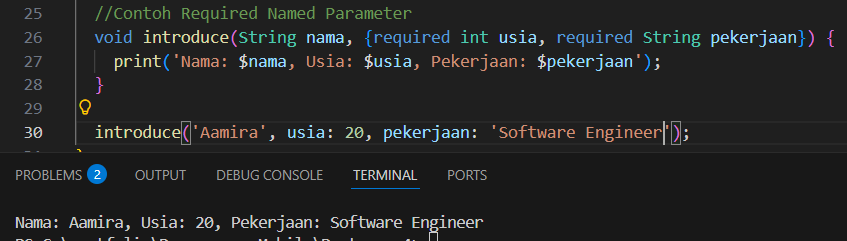

#### No 4:
Jelaskan maksud Functions sebagai first-class objects beserta contoh sintaknya!

Jawab:

Function sebagai first-class object, artinya function bisa disimpan dalam variabel, dikirim sebagai parameter, dan dikembalikan dari function lain.

Contoh sintaks:

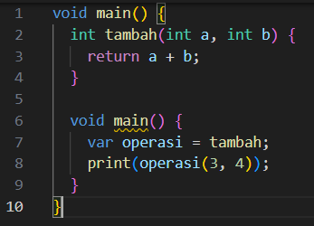

#### No 5:
Apa itu Anonymous Functions? Jelaskan dan berikan contohnya!

Jawab:
Anonymous function adalah function yang tidak memiliki nama dan biasanya digunakan langsung pada suatu operasi.

Contoh:

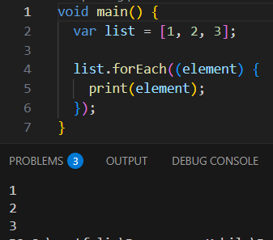

Function (item) { print(item); } adalah anonymous function.

#### No 6:
Jelaskan perbedaan Lexical scope dan Lexical closures! Berikan contohnya!

Jawab:

Lexical scope adalah aturan yang menentukan bahwa suatu variabel hanya dapat diakses oleh kode yang berada dalam lingkup (scope) tempat variabel tersebut dideklarasikan.

Contoh:

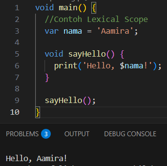

Variabel nama dideklarasikan di dalam main(), sehingga fungsi sayHello() yang berada di dalam scope yang sama dapat mengakses variabel tersebut.

Lexical closure adalah fungsi yang menyimpan dan tetap dapat mengakses variabel dari scope luar meskipun fungsi luar tersebut sudah selesai dijalankan.

Contoh:

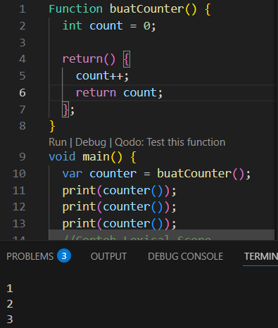

Variabel count tetap tersimpan walaupun fungsi buatCounter() sudah selesai dijalankan, karena digunakan oleh fungsi yang dikembalikan.

#### No 7:
Jelaskan dengan contoh cara membuat return multiple value di Functions!

Jawab:

Di dart, sebuah function dapat mengembalikan lebih dari satu nilai dengan menggunakan Record. Record memungkinkan beberapa nilai dengan tipe berbeda disimpan dan dikembalikan dalam satu fungsi.

Contoh:

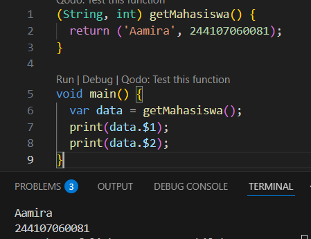

Fungsi getMahasiswa() mengembalika dua nilai sekaligus yaitu nama (String) dan NIM (int) dalam bentuk record (String, int). Nilai yang dikembalikan dapat diakses menggunakan positional field seperti $1 untuk nilai pertama dan $2 untuk nilai kedua. Dengan cara ini, satu fungsi dapat mengembalikan beberapa data sekaligus.

     
