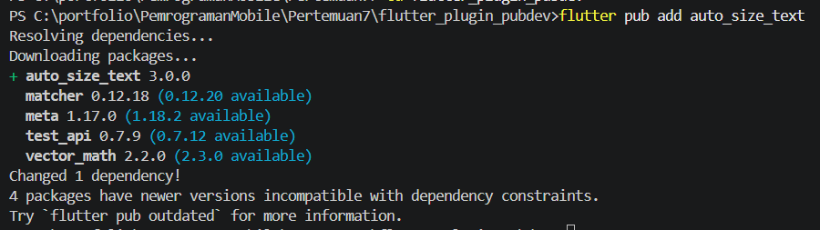
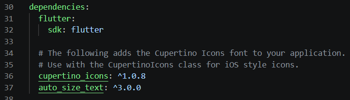
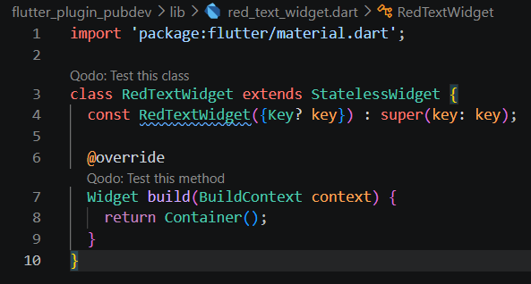
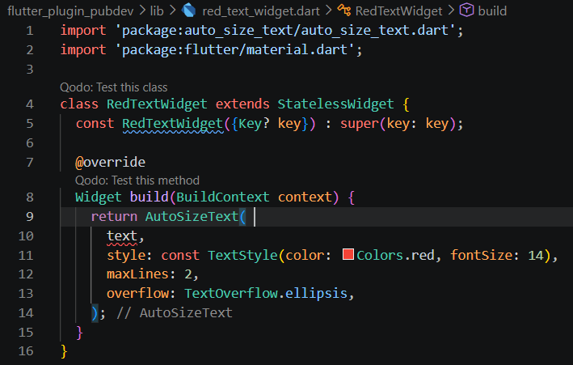
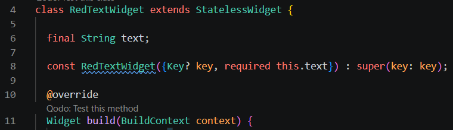
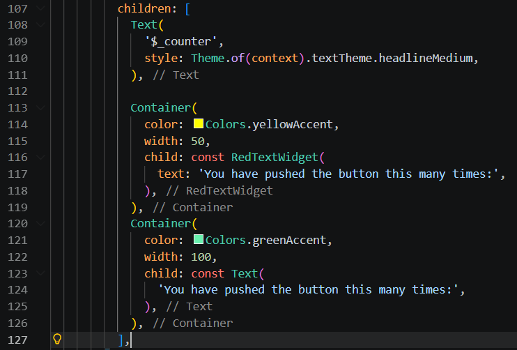
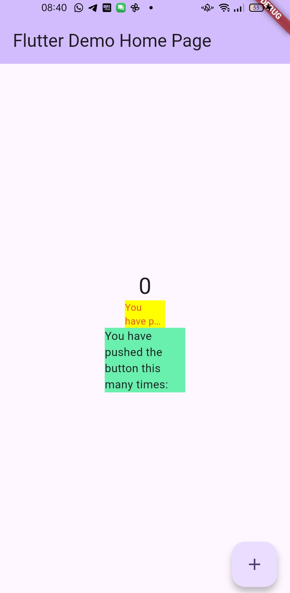

# Laporan Praktikum #07 - Manajemen Plugin

Nama: Aamira Faheema Ghania  
NIM: 244107060081                  
Kelas: SIB-2D     
Absen: 01                             

## 7. Praktikum Menerapkan Plugin di Project Flutter
### Langkah 1: Buat Project Baru
Buatlah sebuah project flutter baru dengan nama flutter_plugin_pubdev. 

### Langkah 2: Menambahkan Plugin
Menambahkan plugin auto_size_text dengan menggunakan perintah berikut di terminal

Ketika berhasil, maka akan tampil nama plugin beserta versinya di file pubspec.yaml pada bagian dependencies.

### Langkah 3: Buat file red_text_widget.dart
Buat file baru bernama red_text_widget.dart di dalam folder lib lalu diisi dengan kode berikut

### Langkah 4: Tambah Widget AutoSizeText
Di file red_text_widget, untuk menggunakan plugin auto_size_text, ubah kode return Container()

Error tersebut terjadi karena variabel text digunakan di dalam AutosizeText, tetapi tidak pernah dideklarasikan atau diberikan nilainya di dalam class RedTextWidget. Akibatnya, Flutter tidak mengenali apa itu text dan menimbulkan error. 

### Langkah 5: Buat Variabel text dan parameter di constructor
Menambahkan variabel text dan parameter di constructor seperti berikut

### Langkah 6: Tambahkan widget di main.dart
Buka file main.dart lalu tambahkan di dalam children: pada class _MyHomePageState

Hasil run:

## 8. Tugas Praktikum
### No. 2
Jelaskan maksud dari langkah 2 pada praktikum tersebut!

Jawab:

Langkah 2 tersebut menunjukkan berhasil menambahkan package auto_size_text ke dalam project Flutter menggunakan perintah flutter pub add auto_size_text. Flutter secara otomatis mengunduh package tersebut dan menambahkannya ke file pubspec.yaml dengan versi yang sesuai.

### No. 3 
Jelaskan maksud dari langkah 5 pada praktikum tersebut!

Jawab:

Langkah 5 tersebut bertujuan untuk menambahkan properti text pada widget agar menjadi dinamis dan reusable. Dengan mendeklarasikan final String text; dan menggunakan required this.text pada constructor, widget RedTextWidget tidak lagi menampilkan teks yang statis, tetapi bisa menerima input teks dari luar saat dipanggil. 

### No. 4
Pada langkah 6 terdapat dua widget yang ditambahkan, jelaskan fungsi dan perbedaannya!

Jawab:

Pada langkah 6, RedTextWidget digunakan sebagai widget custom yang sudah memiliki pengaturan khusus, sehingga bisa digunakan berulang dengan tampilan konsisten. Sedangkan Text adalah widget bawaan Flutter yang digunakan untuk menampilkan teks secara langsung tanpa kustomisasi tambahan. Perbedaannya, RedTextWidget lebih fleksibel dan reusable, sementara Text lebih sederhana dan langsung digunakan.

### No. 5
Jelaskan maksud dari tiap parameter yang ada di dalam plugin auto_size_text berdasarkan tautan pada dokumentasi ini !

Jawab:

- key : Digunakan untuk mengontrol identitas widget di dalam widget tree (membantu Flutter saat rebuild).

- textKey : Key khusus untuk widget Text yang dihasilkan di dalam AutoSizeText.

- style : Mengatur gaya teks seperti warna, ukuran, font, dll.

- minFontSize : Ukuran font minimum saat teks diperkecil agar tetap muat.

- maxFontSize : Ukuran font maksimum yang bisa digunakan.

- stepGranularity : Jarak perubahan ukuran font saat menyesuaikan (misal turun 1, 2, dll).

- presetFontSizes : Daftar ukuran font yang sudah ditentukan (harus urut dari besar ke kecil).

- group : Menyamakan ukuran font beberapa AutoSizeText agar konsisten.

- textAlign : Mengatur perataan teks (kiri, tengah, kanan).

- textDirection : Menentukan arah teks (kiri ke kanan atau sebaliknya).

- locale : Menentukan bahasa/lokasi untuk pemilihan font yang sesuai.

- softWrap : Mengatur apakah teks boleh pindah baris otomatis.

- wrapWords : Menentukan apakah kata yang terlalu panjang boleh dipotong ke baris berikutnya.

- overflow : Mengatur tampilan jika teks melebihi batas (misalnya ellipsis ...).

- overflowReplacement : Widget pengganti jika teks tetap tidak muat.

- textScaleFactor : Mengatur skala ukuran teks secara keseluruhan.

- maxLines : Membatasi jumlah maksimal baris teks.

- semanticsLabel : Label alternatif untuk aksesibilitas (misalnya screen reader).

