# Laporan Praktikum #09 - Kamera

Nama: Aamira Faheema Ghania  
NIM: 244107060081                  
Kelas: SIB-2D     
Absen: 01                             

## Praktikum 1: Mengambil Foto dengan Kamera di Flutter
### Langkah 1: Buat Project Baru
Buat sebuah project flutter baru dengan nama kamera_flutter.

### Langkah 2: Tambah dependensi yang diperlukan
Memerlukan tiga dependensi pada project flutter untuk menyelesaikan praktikum ini.

camera → menyediakan seperangkat alat untuk bekerja dengan kamera pada device.

path_provider → menyediakan lokasi atau path untuk menyimpan hasil foto.

path → membuat path untuk mendukung berbagai platform.

Untuk menambahkan dependensi plugin, jalankan perintah flutter pub add:

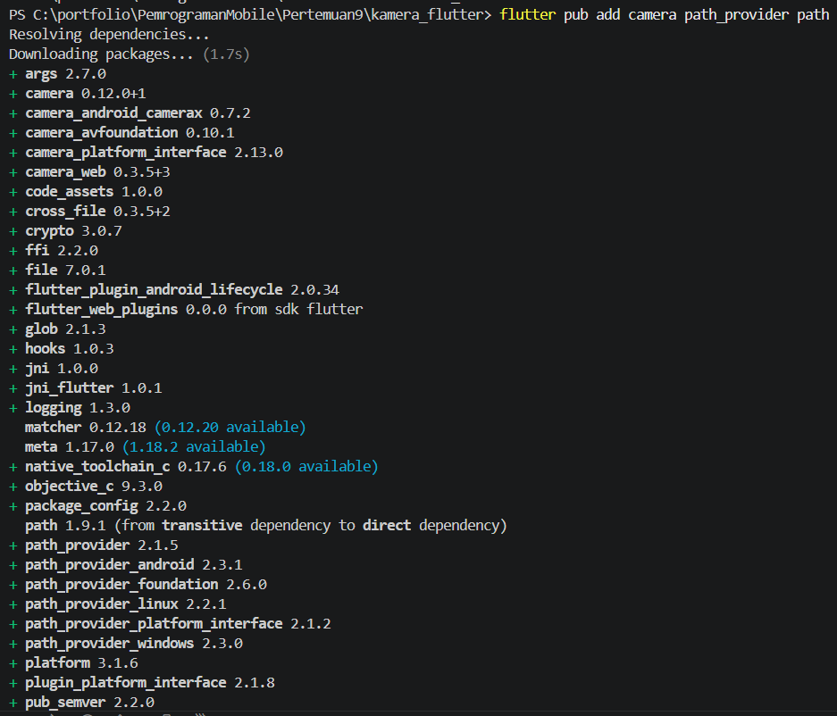

### Langkah 3: Ambil Sensor Kamera dari device
Selanjutnya, perlu mengecek jumlah kamera yang tersedia pada perangkat menggunakan plugin camera seperti pada kode berikut ini. Kode ini letakkan dalam void main(). Dan ubah void main() menjadi async function.

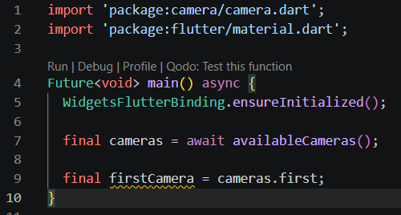

### Langkah 4: Buat dan inisialisasi CameraController
Setelah kamera dapat diakses, langkah-langkah berikut digunakan untuk membuat dan menginisialisasi CameraController. Pada langkah berikut ini, akan membuat koneksi ke kamera perangkat yang memungkinkan untuk mengontrol kamera dan menampilkan pratinjau umpan kamera.

1. Buat StatefulWidget dengan kelas State pendamping.
2. Tambahkan variabel ke kelas State untuk menyimpan CameraController.
3. Tambahkan variabel ke kelas State untuk menyimpan Future yang 4. dikembalikan dari CameraController.initialize().
4. Buat dan inisialisasi controller dalam metode initState().
5. Hapus controller dalam metode dispose().

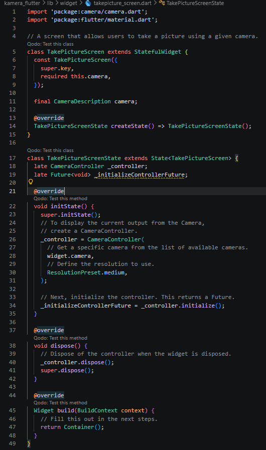

### Langkah 5: Gunakan CameraPreview untuk menampilkan preview foto
Gunakan widget CameraPreview dari package camera untuk menampilkan preview foto. Perlu tipe objek void berupa FutureBuilder untuk menangani proses async.

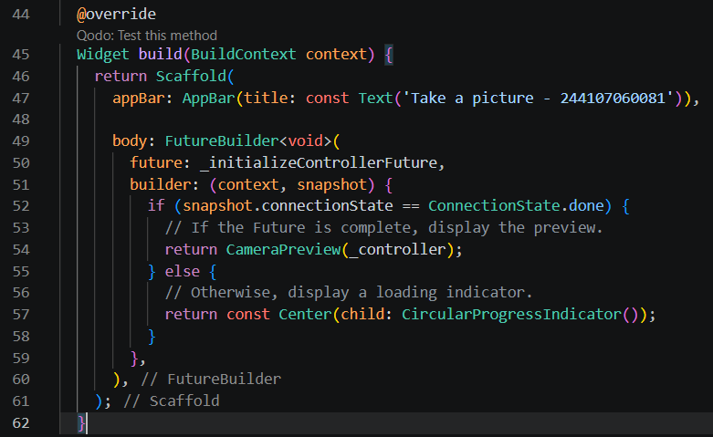

### Langkah 6: Ambil foto dengan CameraController
CameraController dapat digunakan untuk mengambil gambar menggunakan metode takePicture(), yang mengembalikan objek XFile, merupakan sebuah objek abstraksi File lintas platform yang disederhanakan. Pada Android dan iOS, gambar baru disimpan dalam direktori cache masing-masing, dan path ke lokasi tersebut dikembalikan dalam XFile.

Pada codelab ini, buatlah sebuah FloatingActionButton yang digunakan untuk mengambil gambar menggunakan CameraController saat pengguna mengetuk tombol.

Pengambilan gambar memerlukan 2 langkah:

1. Pastikan kamera telah diinisialisasi.
2. Gunakan controller untuk mengambil gambar dan pastikan ia mengembalikan objek Future.

Praktik baik untuk membungkus operasi kode ini dalam blok try / catch guna menangani berbagai kesalahan yang mungkin terjadi.

Kode berikut diletakkan dalam Widget build setelah field body.

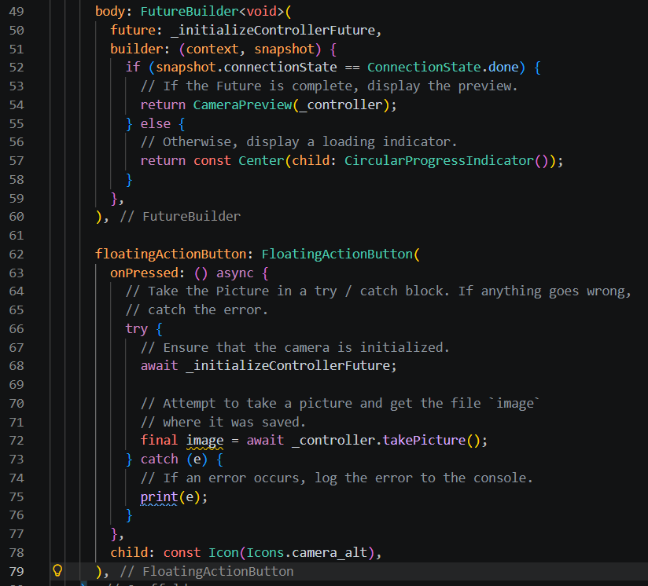

### Langkah 7: Buat widget baru DisplayPictureScreen
Buat file baru di dalam folder widget dengan nama displaypicture_screen.dart

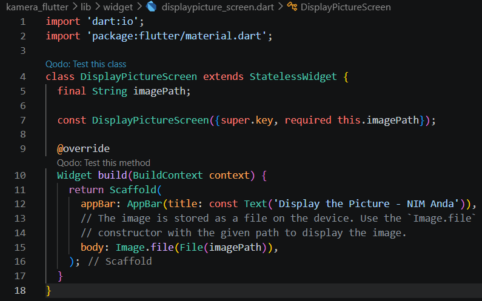

### Langkah 8: Edit main.dart
Edit pada file main.dart bagian runApp:

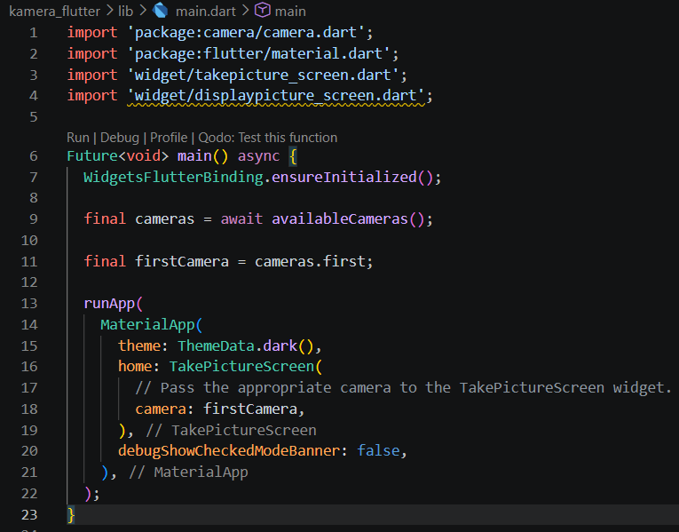

### Langkah 9: Menampilkan hasil foto
Tambahkan kode seperti berikut pada bagian try / catch agar dapat menampilkan hasil foto pada DisplayPictureScreen.

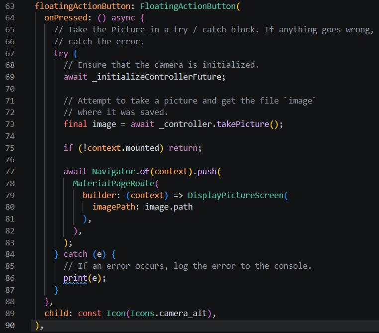

Hasil run:

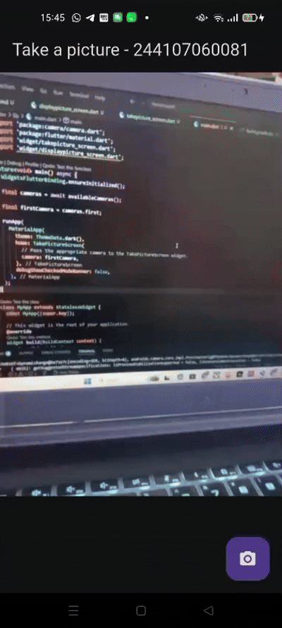

## Praktikum 2: Membuat photo filter carousel
### Langkah 1: Buat project baru
Buatlah project flutter baru di pertemuan 09 dengan nama photo_filter_carousel

### Langkah 2: Buat widget Selector ring dan dark gradient
Buatlah folder widget dan file baru dengan nama filter_selector.dart

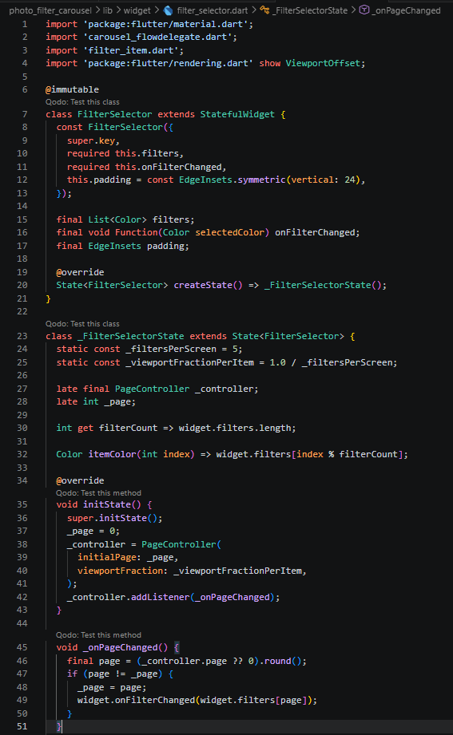

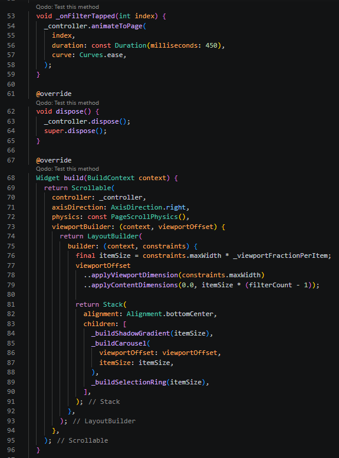

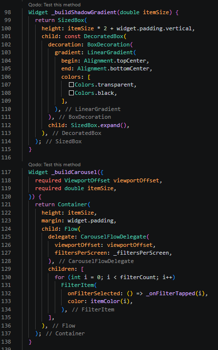

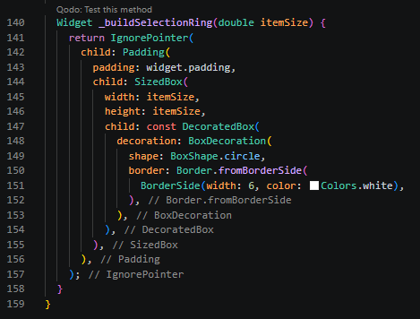

### Langkah 3: Buat widget photo filter carousel
Buat file filter_carousel.dart di folder widget

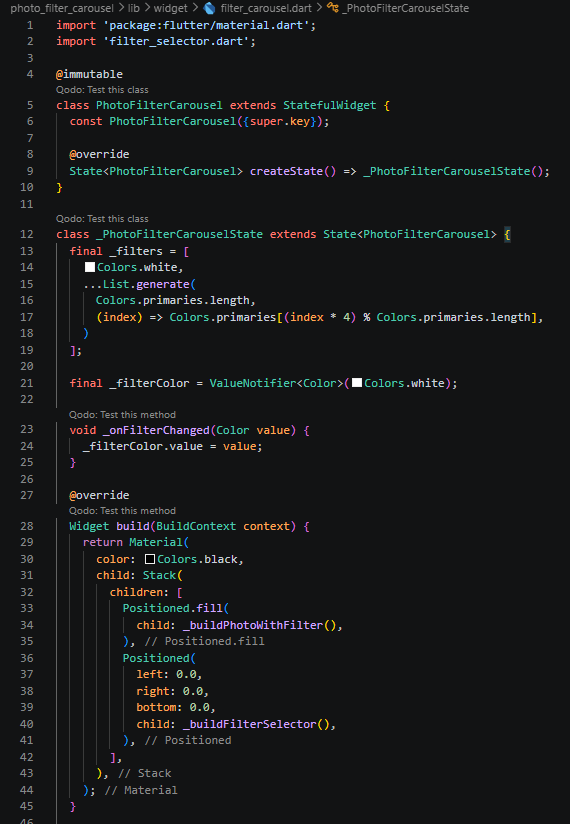

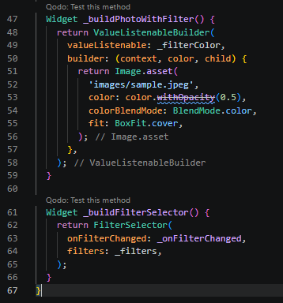

### Langkah 4: Membuat filter warna - bagian 1
Buat file carousel_flowdelegate.dart di folder widget

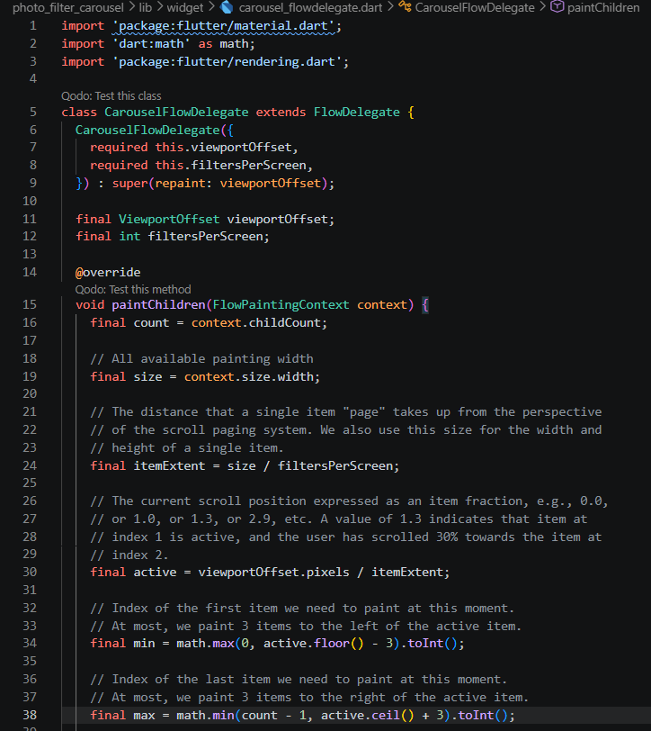

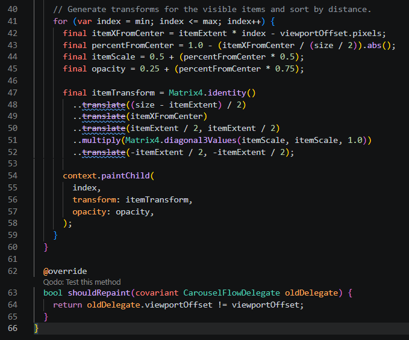

### Langkah 5: Membuat filter warna
Buat file filter_item.dart di folder widget

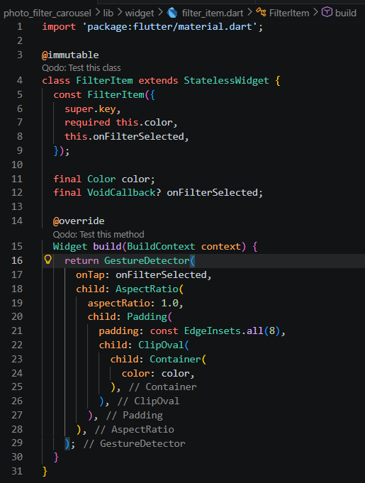

### Langkah 6: Implementasi filter carousel
Terakhir, kita impor widget PhotoFilterCarousel ke main seperti kode berikut ini.

Hasil run:

## 5. Tugas Praktikum
### No. 2
Gabungkan hasil praktikum 1 dengan hasil praktikum 2 sehingga setelah melakukan pengambilan foto, dapat dibuat filter carouselnya!

Jawab:

Perubahan kode:

Ubah navigasi di TakePictureScreen

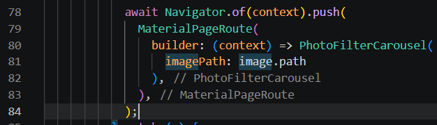

Ubah PhotoFilterCarousel agar menerima gambar dari kamera 

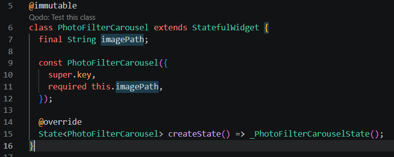

Ganti Image.asset jadi Image.file dan import 'dart:io'

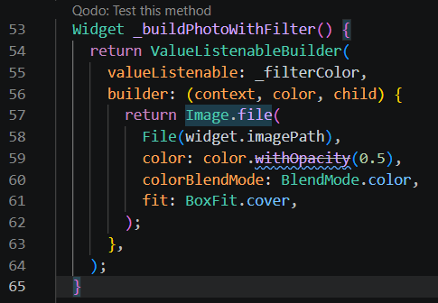

Hasil run:

### No. 3
Jelaskan maksud void async pada praktikum 1?

Jawab:

Penggunaan async pada main berarti fungsi tersebut dijalankan secara asynchronous sehingga dapat menangani proses yang membutuhkan waktu, seperti mengambil daftar kamera dengan await availableCameras(). Dengan async, program akan menunggu proses tersebut selesai terlebih dahulu sebelum melanjutkan menjalankan aplikasi, sehingga data yang dibutuhkan sudah siap dan aplikasi dapat berjalan dengan benar.

### No. 4
Jelaskan fungsi dari anotasi @immutable dan @override ?

Jawab:

Anotasi @immutable digunakan untuk menandai bahwa sebuah class tidak boleh memiliki perubahan data setelah dibuat (semua field harus final).
Sedangkan @override digunakan untuk menandai bahwa suatu method menimpa (override) method dari parent class.