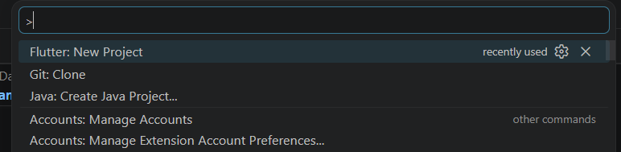
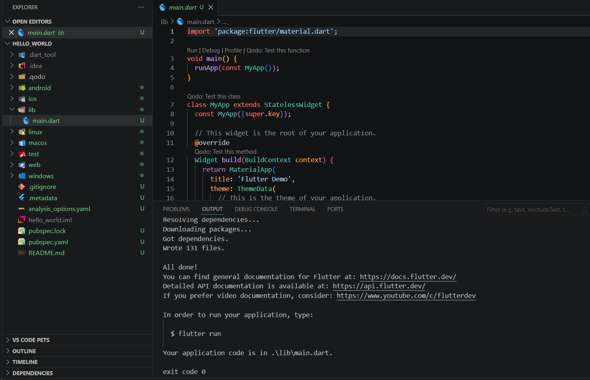
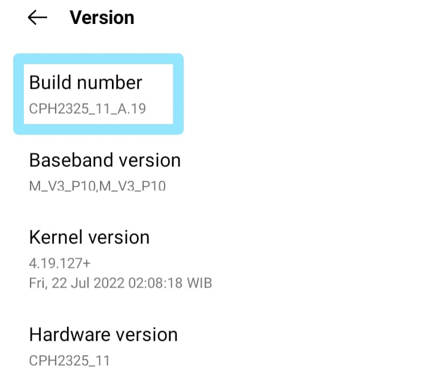
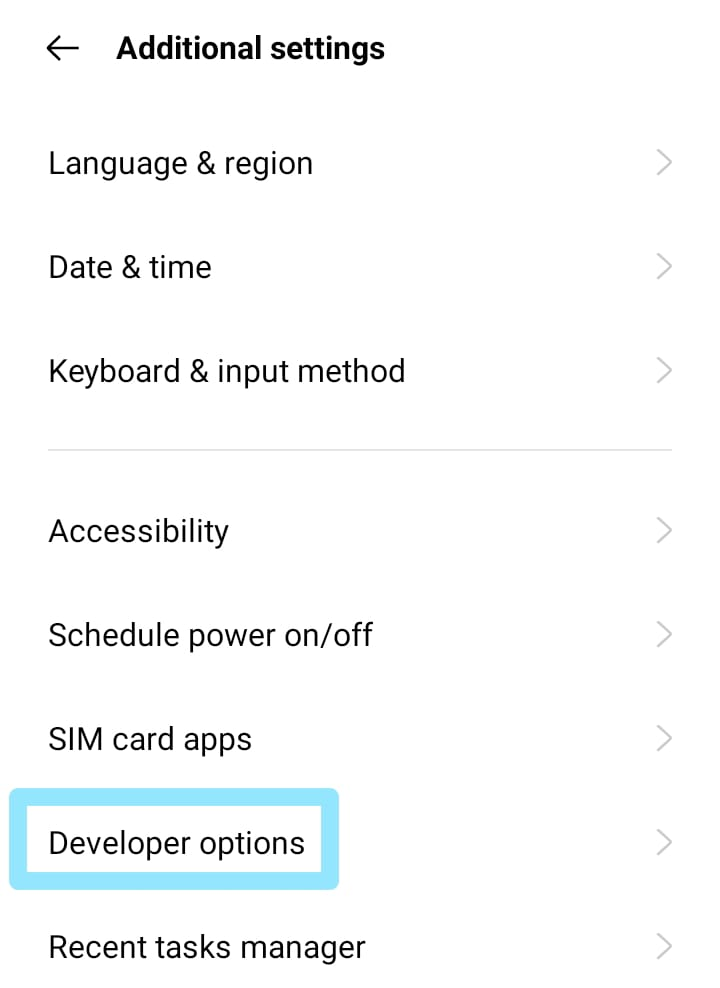
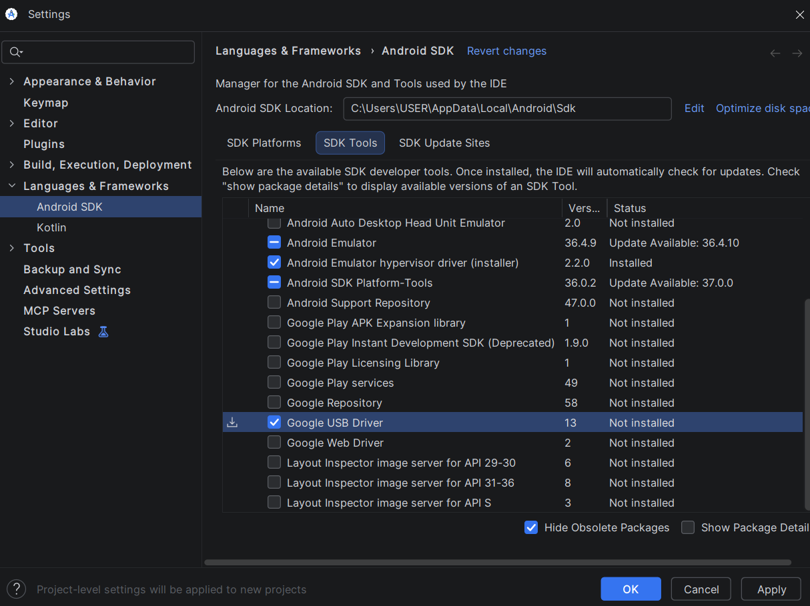
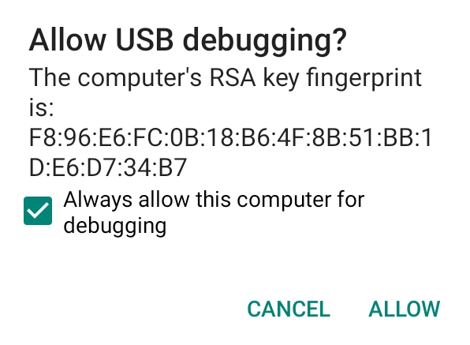
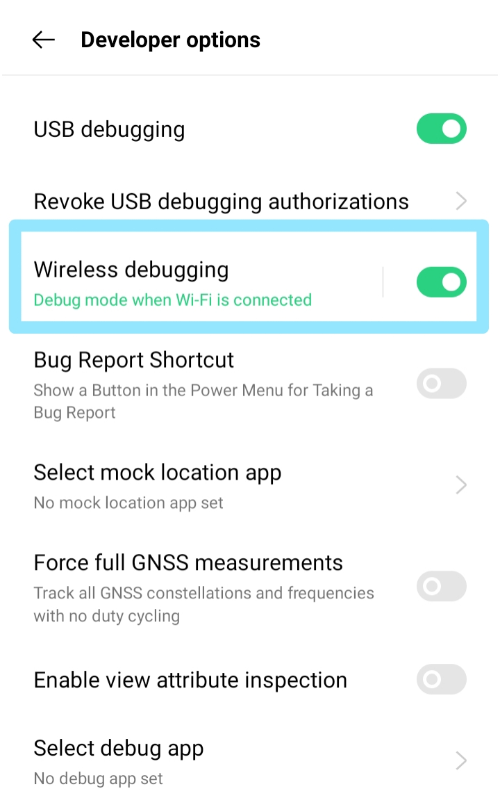
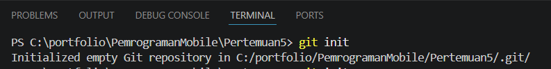
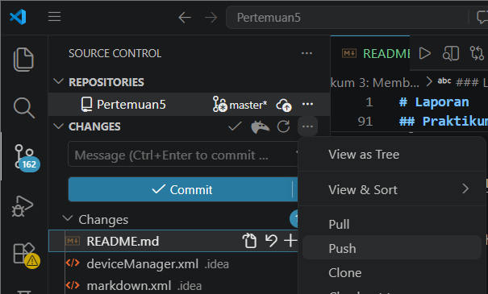

# Laporan Praktikum #05 - Aplikasi Pertama dan Widget Dasar Flutter

Nama: Aamira Faheema Ghania  
NIM: 244107060081                  
Kelas: SIB-2D     
Absen: 01                             

## Praktikum 1: Membuat Project Flutter Baru
### Langkah 1:
Buka VS Code, lalu tekan tombol Ctrl + Shift + P maka akan tampil Command Palette, lalu ketik Flutter. Pilih New Project, lalu pilih Application.

### Langkah 2:
Kemudian buat folder sesuai style laporan praktikum yang Anda pilih. Disarankan pada folder dokumen atau desktop atau alamat folder lain yang tidak terlalu dalam atau panjang. Lalu pilih Select a folder to create the project in.

### Langkah 3:
Buat nama project flutter hello_world seperti berikut, lalu tekan Enter. Tunggu hingga proses pembuatan project baru selesai.

### Langkah 4:
Jika sudah selesai proses pembuatan project baru, pastikan tampilan seperti berikut. Pesan akan tampil berupa "Your Flutter Project is ready!" artinya Anda telah berhasil membuat project Flutter baru.

## Praktikum 2: Menghubungkan Perangkat Android atau Emulator

### Mengaktifkan proses debug USB
Agar Android Studio dapat berkomunikasi dengan perangkat Android, Anda harus mengaktifkan proses debug USB di setelan Opsi developer di perangkat.

Untuk menampilkan opsi developer dan mengaktifkan Proses debug USB:

1. Di perangkat Android, ketuk Settings > About phone.

2. Masuk ke bagian Version, lalu ketuk Build number tujuh kali.

3. Jika diminta, masukkan sandi atau PIN perangkat. Anda tahu Anda telah berhasil saat melihat pesan You are now a developer!.
4. Kembali ke Settings, lalu ketuk Additional settings > Developer options.

5. Ketuk Opsi developer, lalu ketuk tombol Proses debug USB untuk mengaktifkannya.

### Menginstal Driver USB Google
1. Di Android Studio, klik More Actions > SDK Manager. Dialog Preferences > Language & Frameworks > Android SDK akan terbuka.

2. Klik tab SDK Tools.
3. Pilih Google USB Driver, lalu klik OK.

Setelah selesai, file driver akan didownload ke direktori android_sdk\extras\google\usb_driver. 

### Menjalankan aplikasi di perangkat Android menggunakan kabel
1. Sambungkan perangkat Android ke komputer menggunakan kabel USB. Dialog yang meminta Anda mengizinkan proses debug USB akan muncul di perangkat.
2. Pilih kotak centang Always allow this computer for debugging, lalu ketuk Allow.

3. Buka aplikasi pada Android Studio, lalu jalankan perintah "flutter run" di terminal.

4. Tunggu proses buid dan instalasi aplikasi hingga selesai.
6. Aplikasi akan otomatis terbuka dan berjalan pada perangkat Android.

### Menjalankan aplikasi di perangkat Android menggunakan Wi-Fi
#### Memulai
1. Pastikan komputer dan perangkat terhubung ke jaringan nirkabel yang sama.
2. Pastikan perangkat menjalankan Android 11 atau yang lebih baru. 
3. Pastikan komputer telah memiliki Android Studio versi terbaru. 
4. Pastikan komputer Anda memiliki SDK Platform Tools versi terbaru.

#### Menyambungkan perangkat Anda
1. Di Android Studio, pilih Device Manager, lalu pilih Pair Devices Using Wi-Fi.

Dialog Pair devices over Wi-Fi akan terbuka.

2. Buka Developer options, scroll ke bawah ke bagian Debugging, lalu aktifkan Wireless debugging

3. Pada pop-up Izinkan proses debug nirkabel di jaringan ini?, pilih Allow.
4. Jika ingin menyambungkan perangkat dengan kode QR, pilih Pair device with QR code, lalu pindai kode QR di komputer. Atau, jika ingin menyambungkan perangkat dengan kode penghubung, pilih Pair device with pairing code, lalu masukkan 6 digit kode.

5. Klik jalankan dan selanjutnya dapat men-deploy aplikasi ke perangkat.

## Praktikum 3: Membuat Repository Github dan Laporan Praktikum
### Langkah 1:
Login ke akun GitHub, lalu buat repository baru.
### Langkah 2:
Lalu klik tombol "Create repository".
### Langkah 3:
Kembali ke VS code, project flutter hello_world, buka terminal pada menu Terminal > New Terminal. Lalu ketik perintah berikut untuk inisialisasi git pada project.

### Langkah 4:
Pilih menu Source Control di bagian kiri, lalu lakukan stages (+) pada file .gitignore untuk mengunggah file pertama ke repository GitHub.

### Langkah 5:
Beri pesan commit "tambah gitignore" lalu klik Commit.

### Langkah 6:
Lakukan push dengan klik bagian menu titik tiga > Push

### Langkah 7:
Buka terminal di VS Code, lalu jalankan:  git remote add origin https://github.com/aamiraghania/PemrogramanMobile.git 

### Langkah 8:
Lakukan hal yang sama pada file README.md mulai dari Langkah 4. 

